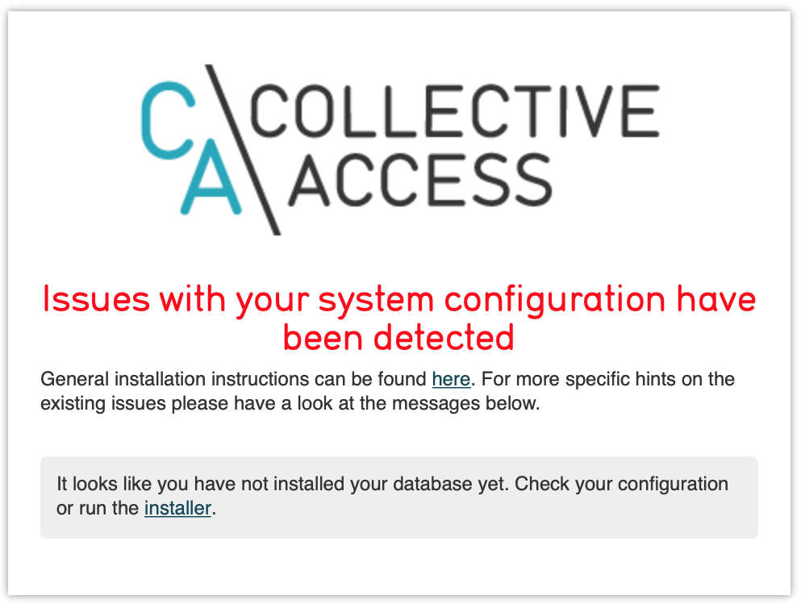
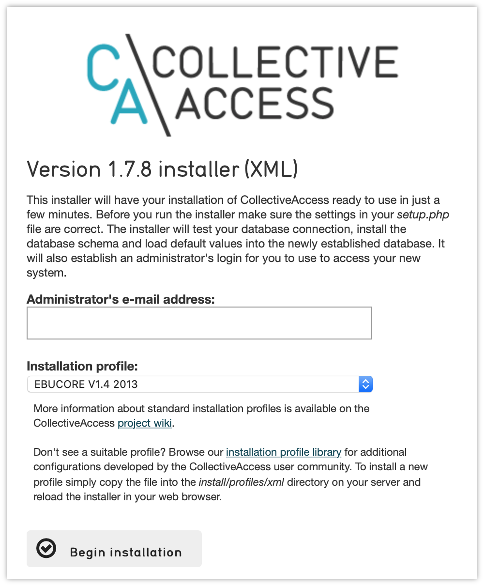
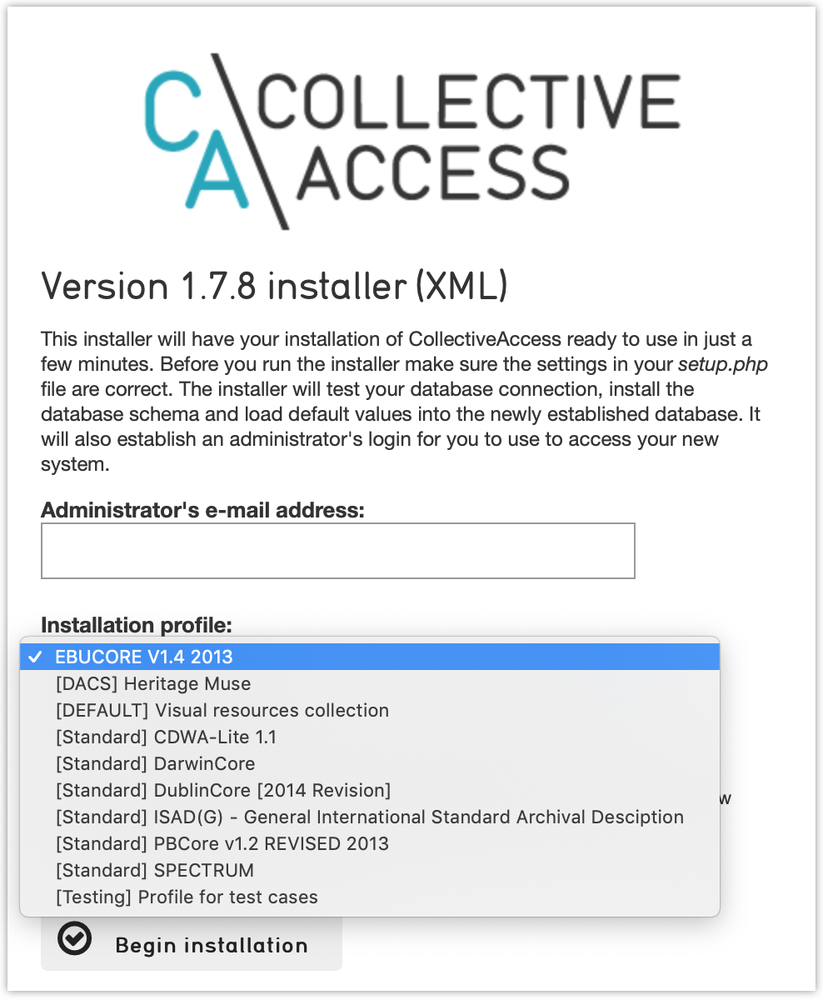

Installing on Mac OS
====================

.. note::
    Note: these instructions have been tested on MacOS 10.14 (Mojave). They may or may not work on earlier versions of MacOS.

CollectiveAccess relies on a number of open-source software packages to run, such as MySQL (database server), PHP (programming lanaguage) and Apache or nginx (web server) to name just a few. The simplest way to install these required packages on Mac OS is to use the `Homebrew <https://brew.sh>`_ package manager. Homebrew can be installed by opening a Mac OS Terminal window and pasting this command:

.. code:: bash

    /usr/bin/ruby -e "$(curl -fsSL https://raw.githubusercontent.com/Homebrew/install/master/install)"

Once installed most required software can be installed using the `brew` command.

Mac OS 10.14 comes with the Apache web server preinstalled. It's tricky to get PHP installed by Homebrew to work with the preinstalled Apache though, so it's best to use Homebrew-managed installation. Before we install Apache with Homebrew, first shutdown the preinstalled server and disable it from starting automatically in the future using these Terminal commands:

.. code:: bash

    sudo apachectl stop
    sudo launchctl unload -w /System/Library/LaunchDaemons/org.apache.httpd.plist 2>/dev/null
    
Now install Apache by typing in Terminal:

.. code:: bash
    
    brew install httpd
    
Next, set Apache to start itself automatically every time you reboot the Mac:

.. code:: bash
    
    sudo brew services start httpd
    
You should now be able to connect to the web server on port 8080 (the default when installing with Brew) by going to the URL `http://localhost:8080` in a web browser running on the Mac. The message "It works!" should display.

.. tip::

    If you want to run Apache on the standard port 80 you'll need to open the Apache configuration file located at `/usr/local/etc/httpd/httpd.conf`, find the line `Listen 8080` and change it to `Listen 80`. Then restart the server with the Terminal command `sudo apachectl -k restart`
    
Next install PHP version 7.2 running in the Terminal:

.. code:: bash
    
    brew install php@7.2
    
Then edit the Apache configuration file located at `/usr/local/etc/httpd/httpd.conf`, adding the line:

.. code:: 

    LoadModule php7_module /usr/local/opt/php@7.2/lib/httpd/modules/libphp7.so

Next, look for this configuration in the Apache configuration file:

.. code:: 

    <IfModule dir_module>
        DirectoryIndex index.html
    </IfModule>
    
and replace it with this:

.. code:: 

    <IfModule dir_module>
        DirectoryIndex index.php index.html
    </IfModule>

    <FilesMatch \.php$>
        SetHandler application/x-httpd-php
    </FilesMatch>

Restart the server with the Terminal command `sudo apachectl -k restart`. You should now have PHP enabled within your Apache web server.

In order to use the PHP on the Terminal command line (which can be handy) you'll need to add the Homebrew PHP installation directory into your command PATH. Do this by entering in the Terminal:

.. code:: bash

    echo 'export PATH="/usr/local/opt/php@7.2/bin:$PATH"' >> ~/.bash_profile
    echo 'export PATH="/usr/local/opt/php@7.2/sbin:$PATH"' >> ~/.bash_profile
    
Close the current Terminal window and open a new one. Typing `php -v` in the Terminal should return output similar to:

.. code::

    PHP 7.1.23 (cli) (built: Feb 22 2019 22:08:13) ( NTS )
    Copyright (c) 1997-2018 The PHP Group
    Zend Engine v3.1.0, Copyright (c) 1998-2018 Zend Technologies
    
Now let's install MySQL. CollectiveAccess works with version 5.7. It is not yet compatible with version 8.0. To install version 5.7:

.. code::

    brew install mysql@5.7

Then add the MySQL install to your command line path with:

.. code::

    echo 'export PATH="/usr/local/opt/mysql@5.7/bin:$PATH"' >> ~/.bash_profile

You will need to close the Terminal window and open a new one for the path changes to take effect. Next start up MySQL, and configure it to restart automatically on reboot:

.. code::
    
    brew services start mysql@5.7
    
If you don't want MySQL starting up automatically every time you boot your machine you can start it up on demand using `brew services run mysql@5.7`

Next we install various packages to support processing of media: ffmpeg (audio/video), Ghostscript (PDFs), GraphicsMagick (mages), mediainfo (metadata extraction and xpdf (content extraction from PDFs):

.. code::
    
    brew install ffmpeg ghostscript GraphicsMagick mediainfo xpdf

Finally, we are ready to install the CollectiveAccess `Providence` back-end cataloguing application. The web server we installed earlier uses `/usr/local/var/www` for documents by default (the "web server root" directory). We are going to place CollectiveAccess in this directory, in a subdirectory named `ca`. A URL for this directory will be http://localhost:8080/ca (assuming that you're still running on port 8080). If you're running on port 80, the URL will be http://localhost/ca.

.. tip::
    
    You can use a different directory for the application by editing `/usr/local/etc/httpd/httpd.conf`. Edit the line `DocumentRoot "/usr/local/var/www"` to point to your chosen directory.

You can download a release from https://github.com/collectiveaccess/providence/releases, or install is with Git. Using a release in somewhat simpler to install, while using Git allows you to easily update files and switch to development versions of CollectiveAccess.

To install with Git, in the Terminal change directory into the web server root directory.

.. code::

     cd /usr/local/var/www
     
Then "clone" the Providence application code from GitHub:

.. code::

    git clone https://github.com/collectiveaccess/providence.git ca
    
If you prefer to download a release, place the release ZIP or tgz file downloaded from https://github.com/collectiveaccess/providence/releases into /usr/local/var/www and uncompress it. Then rename the resulting directory (named something like `providence-1.7.8`) to `ca`.

In the Terminal change directory into the `ca` application directory and copy the `setup.php-dist` file to `setup.php`. This file contains basic configuration for Providence. The "-dist" version is simply a template. The `setup.php` copy will need to be customized for your installation:

.. code::
    
    cd  /usr/local/var/www/ca
    cp setup.php-dist setup.php

Edit `setup.php`, changing settings to suit. At a minimum you will need to edit the database login settings `__CA_DB_USER__`, `__CA_DB_PASSWORD__`, `__CA_DB_DATABASE__`. You may want to edit other settings, which are described in setup.php. You should also edit the `__CA_STACKTRACE_ON_EXCEPTION__` to be true. This will allow you to receive full error messages on screen if something goes wrong.

By default brew installs the MySQL database with an all-access, password-less administrative account named `root`. It's generally insecure to leave this account password-less, but in a testing environment this may not matter. If you decide to use the root account, set `__CA_DB_USER__` to "root", leave `__CA_DB_PASSWORD__` blank and set `__CA_DB_DATABASE__` to the name you'll use for your database. For this example, we'll assume the database is to be named `my_archive`.

MySQL can support multiple databases in a single installation, so the `my_archive` database must be created explicitly. Log into mysql in the Terminal using the `mysql` command (assuming you haven't set a password for the root account):
    
.. code::

    mysql -uroot

At the `mysql>` prompt enter:

.. code::
    
    CREATE DATABASE my_archive;
    
If you want to use a MySQL login specific to the newly created database, while still at the `mysql>` prompt enter:

.. code::

    GRANT ALL on my_archive.* to my_user@localhost identified by 'my_password';
    
where `my_user` is your preferred MySQL user name and `my_password` is your preferred password for the MySQL login. MySQL logins are specific to MySQL and have nothing to do with your server login. You can set the user name and password to whatever you want, independent of all other login credentials.

Go back to `setup.php` and enter your MySQL login credentials into the `__CA_DB_USER__`, `__CA_DB_PASSWORD__` and `__CA_DB_DATABASE__` settings.

Certain directories in the installation need to be writeable by the web server, within which CA runs. On MacOS, the web server typically runs as the user `www`. Change the permissions on the `app/tmp`, `app/log`, `media` and `vendor` directories to be writeable by `www` in Terminal:

.. code::

    cd  /usr/local/var/www/ca
    sudo chown -R www app/tmp app/log media vendor
    sudo chmod -R 755 app/tmp app/log media vendor

The first `sudo` command will require entry of your MacOS login password. 

Navigate in a web browser to http://localhost:8080/ca (adjusting the port to whatever you have configured, if necessary). You should see:

    
Click on the `installer` link and you should see:

    
Select a profile, enter your email address and click on `Begin installation`. A profile is a preset template with record types, fields and other cataloguing settings that the installer uses to define a new working system. The standard profiles Providence ships with include implementations of widely used standards:

    
You can add your own profiles, or use profiles from other users by dropping profile files in the `/usr/local/var/www/ca/install/profiles/xml` directory.

If you want to experiment with different profiles you may wish to set the `__CA_ALLOW_INSTALLER_TO_OVERWRITE_EXISTING_INSTALLS__` option in setup.php. By default the installer will refuse to install over an existing installation. With `__CA_ALLOW_INSTALLER_TO_OVERWRITE_EXISTING_INSTALLS__` set the installer will include an option to overwrite existing data. In a real system this is **extremely** dangerous – any one with access to the installer can delete the entire system – but is very handy for testing and evaluation.