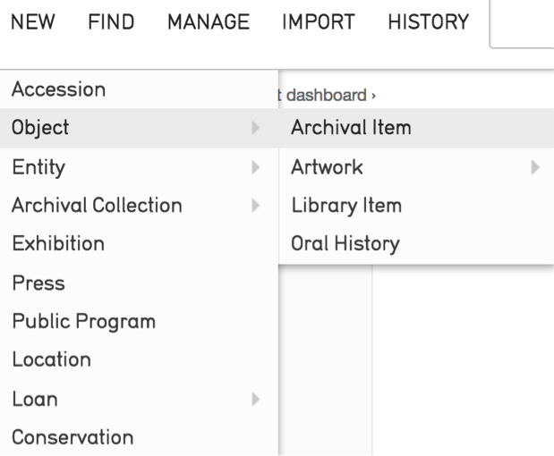
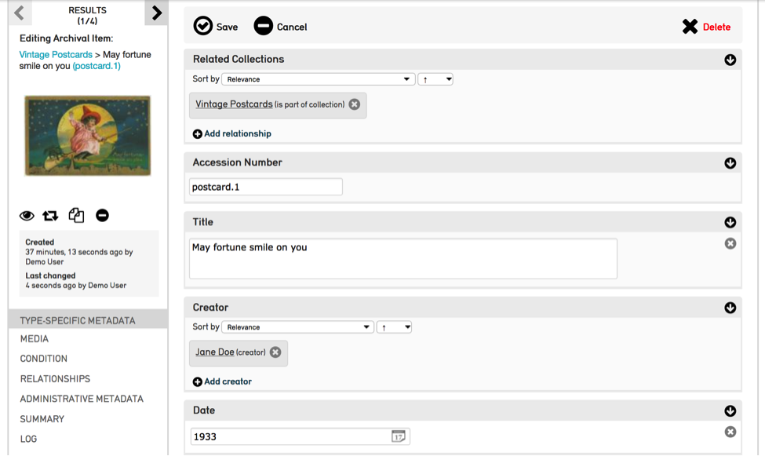
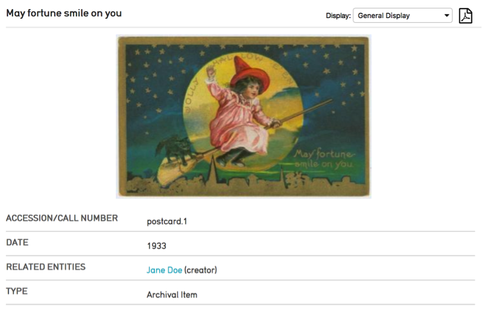
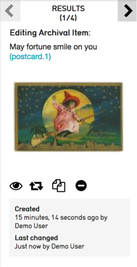
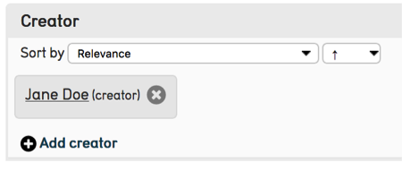
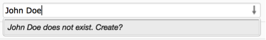
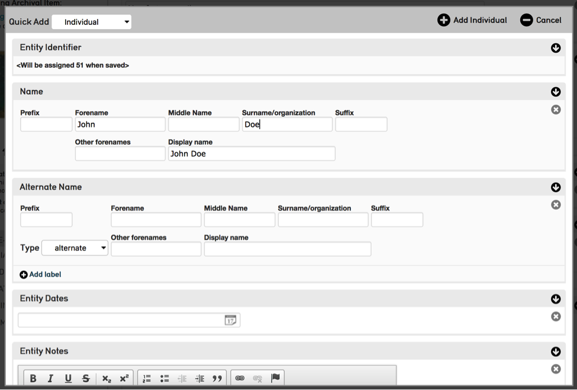
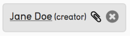
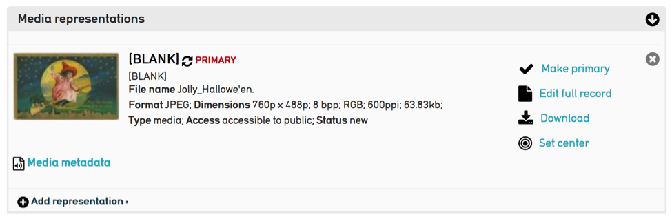
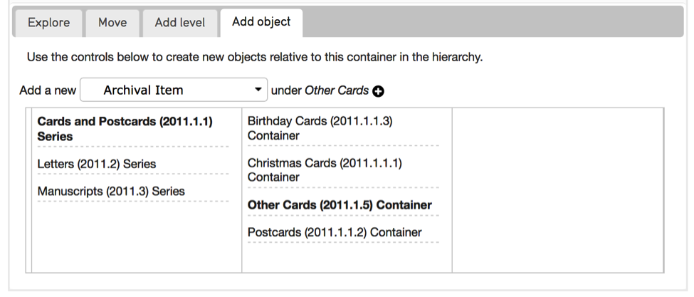

Creating And Editing Records
====================

.. contents::
   :local:
   
Create a New Record
--------------

To create a new record in CollectiveAccess hover over the *New* menu and a list of available tables will appear (Objects, Entities, Locations, etc.). Hover over a particular table to see the available types within that table. Every record in CollectiveAccess is of a particular type and belongs to a particular table. 


*Fig 2.1: Creating a new object*

When you create a new record, CollectiveAccess will take you to the Editor for the particular table and record type. Enter basic data about the record, such as the Title and Identifier and click on the Save button. After saving the new record additional left-hand navigation tabs, or Screens, will become available.


*Fig 2.2: Edit object form*

Editor Screens
--------------
The user interface for each editor is divided into several screens, each of which contains fields to capture different kinds of information about the record. Below is an example of available screens for an Object record. Note that not every screen is applicable to every object type, and some of the metadata elements contained within each screen may vary from type to type, depending on applicability.

- Basic information
- Physical Characteristics
- Media
- Georeference
- Relationships
- Administrative information

In order for changes to be committed to the database, every edit to a record must be saved by clicking the Save button at the top or bottom of the editor screen.

To do batch editing, first create a set (See the manual entry for `Set Tools <https://manual.collectiveaccess.org/usermanual/find.html#set-tools>`_) and then follow the instructions in the `Batch Edit <https://manual.collectiveaccess.org/usermanual/manage.html#batch-edit>`_ manual entry.

To create custom editor screens, see the manual section for `User Interface Configuration <https://manual.collectiveaccess.org/usermanual/user_interface_administration.html#user-interface-configuration>`_.

Record Summary
````````
Record summaries are read-only screens that give an overview of a record in a concise format. They can be downloaded as a record detail report by clicking the PDF icon in the upper right corner of the summary form.

To select a display to use on a record’s summary screen, use the drop-down box in the top right hand side of page. After selecting, the page will update automatically.

See the manual entry `Displays <https://manual.collectiveaccess.org/usermanual/manage.html#displays>`_ to set up custom displays for record summaries.


*Fig 4.3: Choosing a display for use with the summary screen*


Inspector
---------
After a record has been saved for the first time, the inspector window will appear in the top left corner of the record (Fig. 2.3).



*Fig 2.3: The Inspector Window*

**Results Control**
The controls at the top of the inspector allow you to navigate through the results of a search or browse. Use the arrows to go forward or backward through results one by one. Clicking “RESULTS” will take you back to your full list of search results.

**Identifying Information**		
Displayed under the results are the record type, name, accession number, and current location (if applicable and catalogued) of the record you are currently editing

**Watch List Icon** 
Clicking this icon adds the selected record to your watch list, which can be accessed by selecting *Manage > My watched items* from the Global Navigation Bar. The icon turns red when active.
			
**Change Type Icon**
If enabled, this tool allows you to change the record’s “type”. If, for example, you mistakenly created a “Audio” record when you meant to create a “Video” record, you can change the type here without having to delete and re-create the record. Take care using this feature. Changing the record type will cause information in all fields that are not applicable to the new type to be discarded. This action cannot be undone!

**Duplicate Icon** 
This tool allows you to duplicate a record. Duplication can be useful in cases where you are tasked with creating several records with similar metadata. You can control precisely what kind of record data are duplicated (metadata, relationships, media) using the duplication settings under My Preferences > Duplication.

**Less/More Info Icon** 				
This tool collapses or expands the Inspector window to include more information, such as record creation and update times, as well as any Sets the object record may belong to.
					
**Media Thumbnail**					
The inspector window also shows a thumbnail image of attached media. When there are multiple items attached to a record, arrow keys will appear to scroll through all media. Clicking the thumbnail will launch the Media Viewer allowing full-size viewing of images, video and documents, as well as options to download it in a range of sizes. To show/hide the media thumbnail, control click within the inspector. 

Common Metadata Element Types
-----------------------------

Each Editor Screen contains several fields, or metadata elements. Each field is of a particular Data Type that determines what sort of data can be input. Some elements are repeatable. 

A few of the most common Data Types are:

- **Text** – Many metadata elements in the system are simply free text, meaning you can enter any kind of character. Some fields may have Rich Text Editing enabled, which means the field allows text formatting, including bold, italics and underlines.

- **List** – Other fields, such as drop-down menus and checklists, are populated by predefined Lists, which are managed under *Manage > Lists & Vocabularies*. 

- **Date Range** – Accepts any valid date or date range. Dates and date ranges may be entered in a variety of formats. For example, October 25, 2017 may be entered as “October 25, 2017”, “10/25/2017”, “25 October 2017”, “2017-10-25” and more. Broader, inexact dates may also be entered: “October 2017”, “10/2017”, “2017”, “2010s”, “21th century”. Ranges are entered as two dates (exact or inexact) separated with a hyphen: “March 2000 - October 2017”.

- **Currency** – Accepts currency values comprised of a numeric value and a currency symbol. Symbols include $, £, ¥ and €; standard three letter currency abbreviations can also be used.

- **Container** – Bundles together several sub-fields into a single data value. Complex articulated fields built from the types described above can be created using Containers. 


Relationships
-------------

One of the key aspects of CollectiveAccess is the ability to create relationships between records. 


*Fig. 2.4: Relationship bundles*


*Fig 2.5: Quick Add prompt*

A relationship bundle works differently from a metadata element. When you enter a name into a relationship bundle, a type-ahead search is performed on the system. If the search finds matches, you’ll be prompted to select one and add the relationship. (Fig. 2.4) 

**Quick Add**
If the Quick Add feature is enabled for a relationship, you’ll be prompted to create a new record with the entered value if no match is found. (Fig 2.5) If you select the create option, the Quick Add window will appear, and you will be able to create the record without having to leave the record currently being worked on.


*Fig 2.6: Quick Add pop-up editor*

Relationships allow information to be centralized and “pulled” into other records as needed. For example: rather than repeatedly typing the name of an Individual into Object records, you can create a single Entity record for the Individual at the outset, and relate it to the relevant Objects. The centralized Entity record serves as a container for additional Individual information beyond a name, address and more. All related objects can include this Entity information, and changes made to Entity data are instantly reflected everywhere in the database that the Entity is referenced. 

Ensuring that all Objects use consistent data relationships can greatly improve search and browse quality. In the Entity example, relationships make finding all objects by a single creator a simple matter. Further, by minimizing data entry they reduce cataloguing time and opportunities for data entry error.	

**Interstitial Data**
It is possible to catalog metadata on relationships.  For example, an Effective Date field can be used to capture the time a relationship was in effect.  If you have configured interstitial data to be cataloged, you can access it by clicking the paperclip icon that appears in the list of related records.
 

*Fig 2.7: Interstitial icon on related entity record.*


Media Representations
---------------------
				
To attach a media file, click "add representation", then click “choose file” and navigate to the location of the file on your computer, and then press “open”. 

Check one “primary” representation for the record. The primary representation is the media that should be used to illustrate the record in situations where only a single representation can be used, such as in search results. If you would like to upload more files, click the “add representation” button and repeat. When you are done adding files, click the save button.
					
For previewing purposes, the database system will automatically resize uploaded media to various standardized sizes. The original, full size image will be stored in the database and is available for download from the system. For this reason it is best to upload the highest quality image, video or document files available.
					
After you have added media to the record, it will appear on the media page as well as in the Inspector window in the upper left of the page (Fig. 2.3). Clicking on an image in either place will launch the Media Viewer, which allows you to pan, zoom, and cycle through images, play video or view documents, as well as download them at various sizes. The media viewer can be closed by pressing the “x” button in the lower-right hand corner of the Viewer or by using the escape key.


*Fig 2.8: The Media Page After Attaching Images*


To edit information about the image, such as the Access, Title, Caption, etc. click on the “Edit full record” icon within the media bundle (Fig 2.8). 


Hierarchies
-----------
Hierarchies are used in various contexts and for different record types in CollectiveAccess. For example collections, objects, places and vocabularies can all be structured as hierarchies. Regardless of the record type, hierarchies are displayed in editors with a Hierarchy Browser that provides tools for exploration, restructuring and adding new records to the hierarchy.

 .. figure:: ../_static/images/2_9.png
   :name: Hierarchy Explore
   :target: ../_static/images/2_9.png
   :alt: Hierarchy Explore
*Fig 2.9: Explore tab of Collection Hierarchy Browser in Object editor*


*Fig 2.10: Add object tab of Collection Hierarchy Browser in Collection editor*


Deleting Records
----------------

Records in CollectiveAccess can be deleted. Users have the authority to delete records or are prohibited from deleting records based on their Access Role. For users with the proper permissions, deleting a record is as simple as clicking the Delete button to the right of the Save and Cancel buttons. Users will be prompted with a warning prompt (Really delete?) and also prompted with an option to transfer any references the record may have.

**Delete & Transfer**
CollectiveAccess gives users the option to merge records by transfering a record’s references to another record before deleting it. This can be a very useful tool in situations where, for example, two entity records were created for the same person. Perhaps one was erroneously named “Dave Smith” while the correct authority is “David Smith.” You need to remove the duplicative, incorrect Entity but unfortunately “Dave Smith” has been related to many object records. Rather than painstakingly adding the object relationships to “David Smith” by hand, you can simply transfer the relationships from “Dave Smith” to “David Smith” upon the deletion of “Dave Smith”.

When you delete a record that is referenced in other records, you will see a prompt that tells you how many times that particular record is referenced. You have the option to remove all references or transfer references. Under the latter prompt you will find a search bar that will allow you to search for the appropriate record to transfer the relationships to.

**Batch Delete**
It is possible to delete multiple records at once using Sets in conjunction with the Batch Editor. To do this, the user’s access role must be enabled to allow Set and Batch editing. See the manual entry for `Set Tools <https://manual.collectiveaccess.org/usermanual/find.html#set-tools>`_. In short, any set of records can be opened in the batch editor. When you click the “More options” link in the Inspector window of the batch editor, you’ll find a prompt to delete all of the records in the set. Be careful with this feature!
