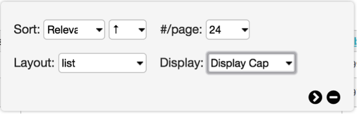

Find - Searching and Browsing
=============================
					
In addition to the QuickSearch, there are three other ways to locate records, each providing a higher degree of precision than the QuickSearch: The basic search, the advanced search, and the browse. All three are accessed from the Find menu in the Global Navigation.

Basic Search
------------
		
At its simplest the basic search is a full text search (Fig. 3.1) across all fields within the table you’re searching in (e.g. *Find > Objects* searches for Object records, *Find > Entities* searches for Entity records). Simply type in a word or phrase and click on the “search” button to receive matching results.

A search syntax may be used to create more precise basic searches that include boolean combinations, wildcard searches, searching on creation and modification dates and more.		

.. figure:: ../_static/images/3_1.png
   :name: Basic search
   :target: ../_static/images/3_1.png
   :alt: Basic search 
*Fig 3.1: Basic search bar*
 
								
Advanced Search
---------------
					
The Advanced Search allows users to define custom search forms, consisting of specific fields. While the basic search, by default, looks across all fields, the advanced search always searches within specific fields and generates highly targeted results. 				

.. figure:: ../_static/images/3_2.png
   :name: Advanced search
   :target: ../_static/images/3_2.png
   :alt: Advanced search 
*Fig 3.2: Example of an advanced search form*

Advanced search forms are created through *Manage > My search tools > Search forms*. 

					
Browse
------
					
The Browse allows you to generate and refine results by filtering on specific attributes of data. For example, by browsing for Objects by Entity, you can retrieve every single object that is created by a particular Individual or Organization. You can further refine these results by selecting additional attributes. For example, by selecting Decades you can choose to retrieve only records made in the 1970s.

.. figure:: ../_static/images/3_3.png
   :name: Browse
   :target: ../_static/images/3_3.png
   :alt: Browse
*Fig 3.3: Browse menu for Objects*
			

Working with Results
--------------------

Once you have generated results using any of the available search tools, there are several options available to control how the data is displayed, refined, edited and exported.

.. figure:: ../_static/images/3_4.png
   :name: Search result tools
   :target: ../_static/images/3_4.png
   :alt: Search result tools 
*Fig 3.4: Search result tools: Export tools, Refine results, Display Options (respectively)*

**Display Options**

*Fig 3.5: Display Options*
			
Click on the display options icon to view all settings to control how search results are displayed.	

**Sort:** choose how results are sorted. You can sort on relevance, title, idno, or any number of other data attributes.

**Ascending/Descending:** specifies the direction to sort, either ascending or descending order.

**#/page:** the maximum number of results to be shown per page (12, 24, 36, 48)

**Layout:** three layout options for search results are available for Objects (a subset of these options are available for other types of records). Thumbnails displays image thumbnails, along with title and idno. The List layout displays results in a tabled format, similar to a spreadsheet. The metadata that is shown is controlled by Displays, explained in detail below. Finally, Full mode displays the primary object image as well as all metadata from the chosen Display, but in a vertical form, rather than a tabled spreadsheet.

.. figure:: ../_static/images/3_6.png
   :name: Full display
   :target: ../_static/images/3_6.png
   :alt: Full display 
*Fig 3.6: Full display*

.. figure:: ../_static/images/3_7.png
   :name: Thumbnail display
   :target: ../_static/images/3_7.png
   :alt: Thumbnail display 
*Fig 3.7: Thumbnail display*

.. figure:: ../_static/images/3_8.png
   :name: List display
   :target: ../_static/images/3_8.png
   :alt: List display 
*Fig 3.8: List display*

**Display:** choose which metadata Display to use to view your search results. Displays allow you to precisely control the fields and formatting displayed in search results or on a Summary page. Once you create custom displays and configure the search results or record summaries, you may batch-edit data in spreadsheet format or export the data as tab or comma delimited files, an Excel spreadsheet or as a PDF. Through their ability to define both fields and precise formatting of field data, displays form the backbone of CollectiveAccess’ reporting system. Once defined, any search or browse result set can be piped through a display and into on-screen, printable or shareable output. 					

**Export Tools**					
Export tools allow you to export the results of a search or browse – with any configured Display – to a variety of formats, including tab and comma delimited, Microsoft Word and Excel, or PDF.

.. figure:: ../_static/images/3_9.png
   :name: Export tools
   :target: ../_static/images/3_9.png
   :alt: Export tools 
*Fig 3.9: Export tools*

			
**Refine Results**					
Refine controls enable filtering of search results using the same controls used for browsing. It is essentially no different from the Browse, except that you can run a full text search first and then use the browse facets to further refine the results of the full text search.

.. figure:: ../_static/images/3_10.png
   :name: Refine results
   :target: ../_static/images/3_10.png
   :alt: Refine results 
*Fig 3.10: Refine results*

**Edit in Spreadsheet**
Spreadsheet mode looks similar to the List mode, but allows you to apply edits directly to most fields in the listed records without leaving the search results screen.

.. figure:: ../_static/images/3_11.png
   :name: Edit in spreadsheet
   :target: ../_static/images/3_11.png
   :alt: Edit in spreadsheet	 
*Fig 3.11: Edit in spreadsheet button*

**Set Tools**
Sets, explained in greater detail below, are ordered, ad-hoc groupings of a single type of record defined by users for a practical purpose (e.g., a working checklist for an upcoming exhibition, or a set of records that need to be completed). Sets are distinct from Collection records in that they are typically temporary groupings and meant for workflow, while Collection records are archival or curatorial in nature and intended to record collection-level cataloging. An additional use of Sets is for grouping records for batch editing en masse using the Batch Editor.

 
.. figure:: ../_static/images/3_12.png
   :name: Set Tools
   :target: ../_static/images/3_12.png
   :alt: Set Tools 
*Fig 3.12: Set Tools	You can create Sets directly from results using Set Tools.*

**Create set:** Allows naming and creation of a set consisting of either a) the entire search results or b) only those checked.

**Open set for batch editing:** Opens the set in the Batch Editor for applying global edits.

**Add checked to Set:** Allows addition of records to pre-existing Sets, by checking them off and selecting “Add checked to Set.”

**Visualization**
Provides visualization options for data when available. Options include maps to visualize records with georeference coordinates and timelines based upon entered dates.	 

.. figure:: ../_static/images/3_13.png
   :name: Visualization Tools
   :target: ../_static/images/3_13.png
   :alt: Visualization Tools
*Fig 3.13: Visualization Tools*

.. figure:: ../_static/images/3_14A.png
   :name: Map
   :target: ../_static/images/3_14A.png
   :alt: Map 
*Map*

.. figure:: ../_static/images/3_14B.png
   :name: Timeline
   :target: ../_static/images/3_14B.png
   :alt: Timeline 	 
*Timeline*

*Fig 3.14: Visualizations*
