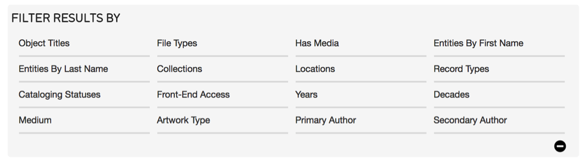

Find - Searching and Browsing
=============================

.. contents::
   :local:
   					

Quick Search
------------
Always available in the upper right-hand corner of the browser window, the QuickSearch is the simplest and most convenient search tool in CollectiveAccess. It will cast a wide net for terms entered into it, searching across all fields in all tables of records.


Basic Search
------------
		
At its simplest the basic search is a full text search (Fig. 3.1) across all fields within the table you’re searching in (e.g. *Find > Objects* searches for Object records, *Find > Entities* searches for Entity records). Simply type in a word or phrase and click on the “search” button to receive matching results.

A search syntax may be used to create more precise basic searches that include boolean combinations, wildcard searches, searching on creation and modification dates and more.		


*Fig 3.1: Basic search bar*
 
								
Advanced Search
---------------
					
The Advanced Search allows users to define custom search forms, consisting of specific fields. While the basic search, by default, looks across all fields, the advanced search always searches within specific fields and generates highly targeted results. 				

.. figure:: ../_static/images/3_2.png
   :name: Advanced search
   :target: ../_static/images/3_2.png
   :alt: Advanced search 
*Fig 3.2: Example of an advanced search form*


Advanced search forms are created through *Manage > My search tools > Search forms*. See the manual entry for `Advanced Search Forms <https://manual.collectiveaccess.org/usermanual/manage.html#advanced-search-forms>`_ for instructions.


Search Syntax
---------------

**Searching for blank values:** As of version 1.4, Advanced Search finds records with no content in a specific field. The following example will return all records with no value for a field: ``[BLANK]``.

**Wildcards:** 
The asterisk ("*") is used as a wildcard character. That is, it matches any text if used on its own. Wildcards may also be used at the end of a word, to match words that start your search term. For example: ``wri*``.
					
**Searching on creation and modification dates** In Quick Search and Basic Search, you can search on the creation and modification dates of records using the special created and modified access points together with a valid date/time expression. For example, to find everything created on April 12, 2012 you can search using:``created:"4/12/2012"``.

You can limit the returned items to those created or modified by a specific user by adding a valid user name after the access point. For example, to find things modified by user "catherine" on April 2012 you can search using: ``modified.catherine:"4/2012"``.

Browse
------
					
The Browse allows you to generate and refine results by filtering on specific attributes of data. For example, by browsing for Objects by Entity, you can retrieve every single object that is created by a particular Individual or Organization. You can further refine these results by selecting additional attributes. For example, by selecting Decades you can choose to retrieve only records made in the 1970s.

.. figure:: ../_static/images/3_3.png
   :name: Browse
   :target: ../_static/images/3_3.png
   :alt: Browse
*Fig 3.3: Browse menu for Objects*
			

Working with Search Results
--------------------

Once you have generated results using any of the available search tools, there are several options available to control how the data is displayed, refined, edited and exported.

.. figure:: ../_static/images/3_4.png
   :name: Search result tools
   :target: ../_static/images/3_4.png
   :alt: Search result tools 
*Fig 3.4: Search result tools: Export tools, Refine results, Display Options (respectively)*


Display Options 
````````

.. figure:: ../_static/images/4_2.png
   :name: Choosing a display in search results
   :target: ../_static/images/4_2.png
   :alt: Choosing a display in search results
*Fig 3.5: Display Options*
			
Click on the display options icon to view all settings to control how search results are displayed.	

**Sort:** choose how results are sorted. You can sort on relevance, title, idno, or any number of other data attributes.

**Ascending/Descending:** specifies the direction to sort, either ascending or descending order.

**#/page:** the maximum number of results to be shown per page (12, 24, 36, 48)

**Layout:** three layout options for search results are available for Objects (a subset of these options are available for other types of records). Thumbnails displays image thumbnails, along with title and idno. The List layout displays results in a tabled format, similar to a spreadsheet. The metadata that is shown is controlled by Displays, explained in detail below. Finally, Full mode displays the primary object image as well as all metadata from the chosen Display, but in a vertical form, rather than a tabled spreadsheet.


.. figure:: ../_static/images/3_6.png
   :name: Full display
   :target: ../_static/images/3_6.png
   :alt: Full display 
*Fig 3.6: Full display*


*Fig 3.7: Thumbnail display*


*Fig 3.8: List display*


**Display:** choose which metadata Display to use to view your search results. For details on creating custom displays, see the manual entry for `Displays <https://manual.collectiveaccess.org/usermanual/manage.html#displays>`_.			


Export Tools
````````				
Export tools allow you to export the results of a search or browse – with any configured Display – to a variety of formats, including tab and comma delimited, Microsoft Word and Excel, or PDF.


.. figure:: ../_static/images/3_9.png
   :name: Export tools
   :target: ../_static/images/3_9.png
   :alt: Export tools 
*Fig 3.9: Export tools*

			
Refine Results
````````				
Refine controls enable filtering of search results using the same controls used for browsing. It is essentially no different from the Browse, except that you can run a full text search first and then use the browse facets to further refine the results of the full text search.


*Fig 3.10: Refine results*


Edit in Spreadsheet
````````
Spreadsheet mode looks similar to the List mode, but allows you to apply edits directly to most fields in the listed records without leaving the search results screen.


.. figure:: ../_static/images/3_11.png
   :name: Edit in spreadsheet
   :target: ../_static/images/3_11.png
   :alt: Edit in spreadsheet	 
*Fig 3.11: Edit in spreadsheet button*

Set Tools
````````
Sets are ordered, ad-hoc groupings of a single type of record defined by users for a practical purpose (e.g., a working checklist for an upcoming exhibition, a selection of records to publish on a website, or a set of records that need editing). Sets are temporary groupings meant to facilitate cataloguing workflows including batch editing and for reporting. The placement of records within a set does not replace cataloguing. Catalogue by entering values in metadata fields for long-term documentation. Sets should be carefully maintained because they can quickly clutter the sets module. Be sure to delete sets after batch editing. 

 
.. figure:: ../_static/images/3_12.png
   :name: Set Tools
   :target: ../_static/images/3_12.png
   :alt: Set Tools 
*Fig 3.12: Set Tools	You can create Sets directly from results using Set Tools.*

**Create Set:** Click on Set Tools in Basic Search to expand the Set Tools options. Name the Set in the Create Set box and make a selection for a) the entire search results or b) only those checked.

**Open Set for batch editing:** Opens the set in the Batch Editor for applying global edits. For information on batch editing see the manual entry for `Batch Edit <https://manual.collectiveaccess.org/usermanual/manage.html#batch-edit>`_.

**Add checked to Set:** Allows addition of records to pre-existing Sets, by checking records and selecting “Add checked to Set.” Check the top-most checkbox to check all records on the current page.

**Find records in Set:** Once at least one set has been created, you can find records in a set by selecting the set from the "Search by Set" menu in the upper left corner of Basic Search and clicking the arrow.

**Manage Sets:** Go to Manage> My Sets> User Sets to review, edit, add and delete all sets. See the manual entry for `My Sets <https://manual.collectiveaccess.org/usermanual/manage.html#my-sets>`_.

Save Searches
````````
Searches can be saved by clicking the “Save Search” link in Basic Search (upper right corner) forms or using the “Save search as” (bottom right corner of form) within Advanced Search forms.

**Perform Saved Search:** Perform a saved search by selecting the search from the "Saved Searches" menu in the upper left corner of Basic Search and clicking the arrow.

***Manage Saved Searches*** You can view, delete and perform all your saved searches in Manage > My Search Tools > Saved Searches.


Visualization
````````
Provides visualization options for data when configured for your system. Options include maps to visualize records with georeference coordinates and timelines based upon entered dates.	 

.. figure:: ../_static/images/3_13.png
   :name: Visualization Tools
   :target: ../_static/images/3_13.png
   :alt: Visualization Tools
*Fig 3.13: Visualization Tools*

.. figure:: ../_static/images/3_14A.png
   :name: Map
   :target: ../_static/images/3_14A.png
   :alt: Map 
*Map*


*Timeline*

*Fig 3.14: Visualizations*
