Manage and Site Administration
==============================

.. contents::
   :local:
   
The Manage menu in the Global Navigation contains many user tools as well as functions restricted to site administrators.

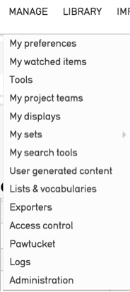
*Fig 4.1: Manage menu*

Preferences
-----------		

Users can set optional preferences by navigating to *Manage > My Preferences*. The settings here are specific to the user and will not affect others users in the system. The default preferences will be sufficient for most users and customizing them is not a requirement. However, users may find a few of the options to be helpful.

**General**
Users can select their preferred language, CollectiveAccess theme, whether to Show current location as 'breadcrumb' trail, retain previous search terms and results when performing a search or browse, and can set whether search terms remain editable in the QuickSearch bar or if they are auto-cleared.

**Editing/Batch Editing/Quick Add**
Users can select which User Interface to use for editing, batch editing and quick add forms for specific record types.

**Media**
Users can establish a filenaming policy for media downloaded from CollectiveAccess. This can be set to download with the original filename (as first uploaded) or to rename each downloaded file to the object identifier and a few other choices.

Users may also select which PDF viewer to employ when viewing PDF documents.

**Units of measurements**
Users can choose how measurements are displayed: as entered, or in metric or imperial units or fractions.

Display currency can also be set. By default, currencies are displayed in USD.

**Duplication**
Users who use the record Duplication tool will likely want to set these preferences. These settings control precisely what is duplicated when the feature is employed. For each table, you may select the metadata on a per-field basis, relationships on a per-table basis, and whether or not media representations are duplicated along with the data.

**QuickSearch**
Here users may select which tables appear in QuickSearch results.

**User Profile**
Users may enter contact information into their profile here.

					
Watched Items
-------------

View and delete items from your watched items list. Items are added to the watched items list by clicking on the eye icon   in the item’s Inspector window.

					
Tools
----- 

System specific, custom plugins are accessed here.


Project Teams
-------------
				
Access to Sets, Displays and Advanced Search forms can be shared by groups of individual user accounts called Project Teams. Teams allow you to create project-specific restricted access groups to collaborate using workflow tools such as Sets, searches and Displays.
					

Displays
--------
					
CollectiveAccess allows fine control over information displayed in search results and in the summary page of records. Any metadata element from the user interface can be added to a Display form. These can be used to view search results, generate PDF reports, or export data to Microsoft Word, Excel, CSV, or other formats. 				
				
See manual entries for `Record Summaries <https://manual.collectiveaccess.org/usermanual/creating_records.html#record-summary>`_ and `Display Options <https://manual.collectiveaccess.org/usermanual/find.html#display-options>`_.
					
					
**Adding a New Display**				
New displays can be created by selecting *Manage > My displays* from the Global Navigation, selecting a record type, and clicking the “+” button.

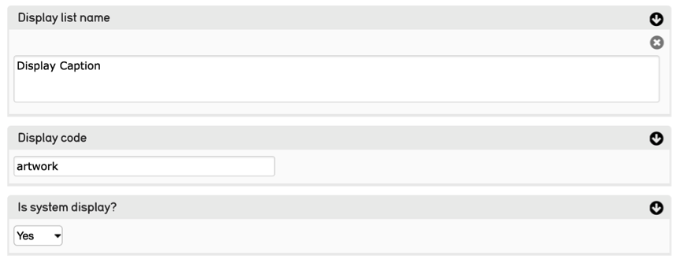
*Fig 4.4: Creating a new display*
				
**Display list name:** Assign a name to the display. This term will appear as an option in the drop-down menu for Displays in the user interface.  
					
**Display Code:** Assign a unique identifier for the display. This identifier should be only letters, numbers and underscores.
					
**Is System Display?** If set to yes, the display will be available to all users system-wide. If set to no, the display will only be accessible to you, the display’s creator, unless you assign User Access individually or Group Access, for project teams.
			
**Display List:** The display list screen is divided into two columns. The left hand side has a list of all the fields available to the User Interface. The right hand column is where you place the contents of the display itself. To do so, click and drag all of the fields you would like to use from the left-hand to the right-hand side. You can customize the display of each field by clicking on the “info” button and changing the values in the displayed settings panel. 

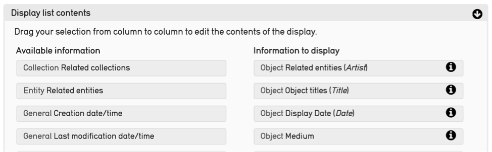
*Fig 4.5: Customizing display fields*

			
My Sets
----

See the manual entry for `Sets <https://manual.collectiveaccess.org/usermanual/find.html#set-tools>`_ which describes creating sets generally and the creation of sets in the context of searching and browsing, and searching for records in a set.
				
**Create a Set**
A new set can also be created by selecting *Manage > My sets*, and then selecting the type of set to create, either a public presentation (for display on a public web site) or a user set (for use in reporting or workflow tasks), and the type of records the set will contain—objects, entities, etc. Then click the "+" icon.
				
Assign a Title and Code to the Set, then apply User, Group Access and Status if necessary. The Introduction field contains text to display for the set if used on a website for a slideshow.


**Items**			
After you have entered basic information about your set and saved, you can click on the Items tab to begin adding records to your set.
					
Items can be found by typing criteria into the search bar, similar to the Basic Search. You will be prompted with relevant matches. Clicking on a match will automatically add it to the set. Once added, items can be dragged and dropped to reorder as desired. Clicking on the white page icon or thumbnail will take you to the set item editor, which allows you to add captions and descriptions to set items. This information is specific to the item in the context of the set, not the record itself.  Set items can be exported in various formats by using the “Export as” option in the upper right corner of the Items tab.  
					
**Delete Sets**
In the set detail view, click the "Delete" button in the upper right corner of the screen to delete the set. This action WILL NOT delete the records in the set. Regularly deleting unused sets is encouraged to avoid clutter in the sets module.

Batch Edit
````````
Batch editing is handled through sets. First create a set of records to batch edit. See the manual entry for `Sets <https://manual.collectiveaccess.org/usermanual/find.html#set-tools>`_ for instructions on creating a set from the record module context. See the manual entry for `My Sets <https://manual.collectiveaccess.org/usermanual/manage.html#my-sets>`_, to create a set via *Manage > My sets*.

Once you have created a set, find the set by navigating to *Manage > My sets > User Sets*. Click on the "magic wand" icon in the list view to batch edit the set. The batch edit icon is also available from the Set detail view which you can enter by clicking on the blank page icon in the list view. From this interface, you can review the items in the set.

The batch edit interface is similar to the record detail editor, with the same tabs on the left that provide access to additional elements. Every metadata element is available to batch edit, as long is it is available to the user as defined through access controls. Find the metadata element you want to batch edit and choose from the options in the drop-down on the right side of the screen. The "add to each" option will add a new value to any existing values for the selected metadata element. The "replace value" option will delete any existing values for the selected metadata element and replace it with the value entered in the batch edit form. The default option for every metadata element is "do not use". No changes will be made to any metadata element with "do not use" selected. Click "execute batch edit" at the top or bottom of the screen to make your changes to every record in the set.

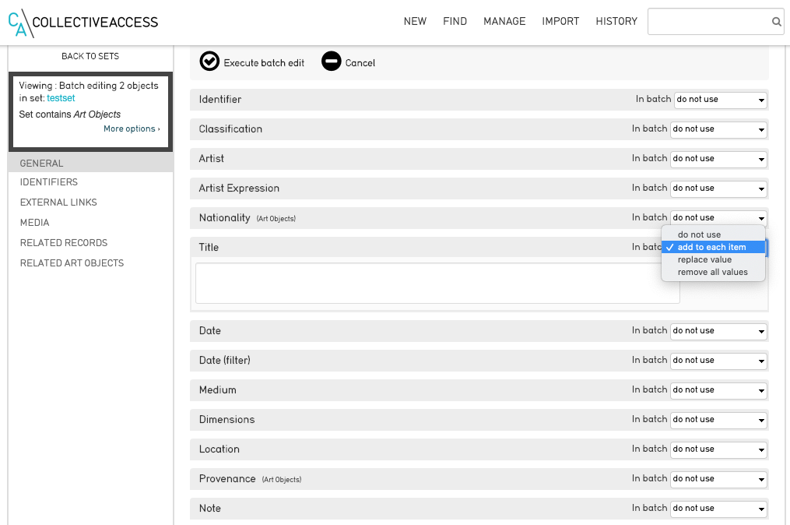
*Fig 4.6: Batch editing*

Click More Options in the upper left side of the screen to reveal options do delete all records in the set and change the record type (for example from photograph to audio) for all records in the set. You will receive a warning message before executing these actions. Use caution with these functions because once performed, they cannot be undone.

Search Tools
------------
					
Advanced Search Forms
````````
Create a custom Advanced Search form to enable searching on precise fields in addition to the broader searching available through the default `Basic Search <https://manual.collectiveaccess.org/usermanual/find.html#basic-search>`_ and `Quick Search <https://manual.collectiveaccess.org/usermanual/find.html#quick-search>`_ options. See the manual entry for `Advanced Search <https://manual.collectiveaccess.org/usermanual/find.html#advanced-search>`_.

**Creating a Search Form**
To create a new search form, navigate to *Manage > My Search Tools > Search Forms*, and then click on the “New Form” button. You can create forms for any table listed in the drop-down in the upper right corner of the form. Select a table and click the "+" icon to create a new form.

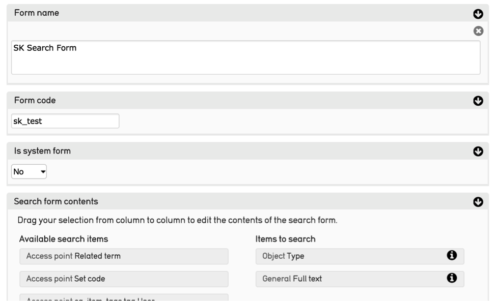
*Fig 4.7: Creating a new advanced search form*

**Assign a Form name** This term will display as an option to select from in the Advanced Search user interface. 

**Assign a Form code** Assign a unique identifier for the display. Use only letters, numbers and underscores.

**Is System Display?** Select whether it is a System form. If set to yes, the form will be available to all users system-wide. If set to no, the form will only be accessible to you, the form’s creator, unless you assign User Access individually or Group Access, for project teams.
					
**Search form contents:** The Search form contents screen is divided into two columns. The left hand side has a list of all the fields available to the User Interface. The right hand column is where you place the contents of the display itself. To do so, click and drag all of the fields you would like to use from the left-hand to the right-hand side. You can customize the display of each field by clicking on the “info” button. 

To test the search form, navigate to the appropriate Advanced Search screen from the Find menu and select the form from the "form" drop-down menu in the upper right corner. Then enter search criteria and click on the “search” button. 

Saved Searches
````````
See the manual entry for `Save Searches <https://manual.collectiveaccess.org/usermanual/find.html#save-searches>`_ for instructions on saving searches.

You can view, delete and perform all your saved searches in *Manage > My Search Tools > Saved Searches*.


User Generated Content
----------------------

User generated content refers tags and comments submitted through the CollectiveAccess front-end component, Pawtucket. These public contributions are reviewed and moderated by navigating to *Manage > User Generated Content*.

**Comments**
Comments are accessed through the Moderate and Search tabs. If your system is configured to require moderation of user generated content before it is published to your Pawtucket-based front-end website, comments requiring moderation will be listed in the Moderate section. The comment, author, date and title of the record commented on are listed for review. Multiple comments can be selected using checkboxes and approved or deleted.

You can find specific comments within the system using the Search section. Similar to the Moderate section, the Search section has checkboxes alongside each entry so multiple comments can be selected for approval or deletion.

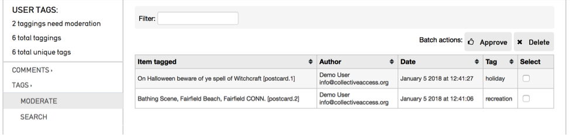
*Fig 4.8: List of tags requiring moderation*


**Tags**
Tags are accessed through the Moderate and Search tabs. If your system is configured to require moderation of user generated content before it is published to your Pawtucket-based front-end website, tags requiring moderation will be listed in the Moderate section. The tag, author, date and title of the tagged record are listed for review. Multiple tags can be selected using checkboxes and approved or deleted.

You can find specific tags within the system using the Search section. Similar to the Moderate section, the Search section has checkboxes alongside each entry so multiple tags can be selected for approval or deletion.


Lists and Vocabularies
----------------------

Many metadata elements and structural attributes of the data model are populated by Lists. Any drop-down menu or checklist has a corresponding list. It is recommended that only one user, the database administrator, edits lists. The process requires training beyond the typical user workflow, and there is the potential to make mistakes that can impact the entire system.

Lists that define the structure of the database use a naming convention that ends in "_types". These lists should never be edited unless the editor intends to alter the data model for the system. The comprehensive set of these lists is below: 

* object_types, collection_types, occurrence_types, entity_types, movement_types, object_lot_types, loan_types, storage_location_types, places_types, object_representations_types, tours_types, tour_stops_types.

The "Add new list" function should only be used to assignlists to new custom fields in the database, a process that is outside the scope of this manual. Instructions for creating new metadata elements is covered in the Collective Access software documentation.


Creating List Items
````````
From *Manage > Lists & Vocabularies* you can edit the list hierarchy. To navigate through the list hierarchy, click on the black arrows. To add a new list item, refer to the phrasing below the "Hierarchy" text to orient your placement of the new list item. See figure 4.8 which reads “Add under Object Classification new concept." The new term will be added to the Object Classification list and will be added to the list items Book, Decorative arts, etc.

The drop down list allows you to choose whether the element you’re about to add is a **“concept,” “facet,” “guide-term,” or “hierarchy name”**. These are distinguishing types for list items analogous to those used in the `Getty Art and Architecture Thesaurus <http://www.getty.edu/research/tools/vocabularies/aat_in_depth.pdf>`_). There are no functional differences between the types. You can leave the drop-down as "concept" if you are unsure which to choose. Once you have made your selection, click on the small “+” icon.

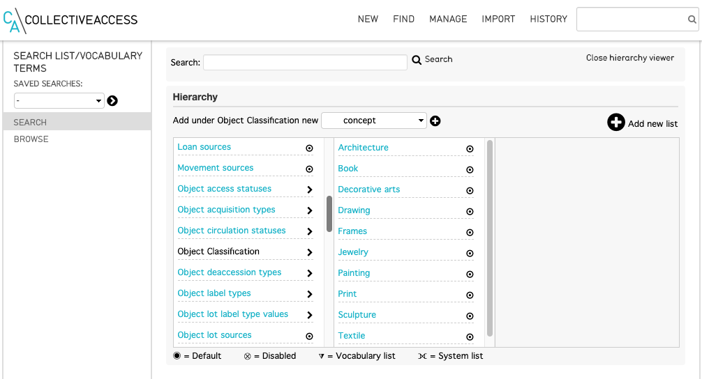
*Fig 4.9: Editing Lists and Vocabularies*		

Once you create the list item you will be prompted to enter values for the list item. In most cases, editing the required fields is sufficient for the new list items records. The optional fields should often be left to the default entry or left blank.

REQUIRED
 * **Item name (singular)** and **Item name (plural)** These terms that will appear in the selection menu.
 * **Identifier** This is the unique identifier for your list, to be used internally throughout the system.
 
OPTIONAL
 * **Description** is an optional field that allows a description of the list item which can be pulled into a report to elaborate on a selected term.
 * **Item Value** Enter a value here if the value to be entered is different from the term in the selection menu.
 * **Is Enabled** Choose "Yes" to allow the term to be selected by a user. Choose "No" if the term serves as a parent category for other list items but should not be an option to select.
 * **Is Default?** Choose "Yes" if the field should default to this value if none is actively selected by the user.
 * **Sort Order** List items can be sorted by this field to determine the order they appear in the selection menu.
 * **Item Color** In some cases it is useful to visually distinguish terms by color. Choose from the color selection tool to associate a color with the list item.
 * **Item Icon** Select an icon to represent the list item.
 * **Access** Choose an access level if the term should have restrictions for a public-facing website.
 * **Status** Choose a status to indicate an administrative workflow status for the list item.

Be sure to click “save” when you are finished entering the basic information for your list. When you return to the list hierarchy viewer you should see your new list item. Select "Back to browser at the upper left corner of the screen to return to the hierarchy overview."

Editing Existing Items
````````

Click on a list item in the hierarchy browser to edit the list item. Edit any of the list item record fields as needed. 


.. note::   **Do not change the Identifier** of an an existing list item if any records are already catalogued with the list item. For example, if 100 records are catalogued with "DR" in a Country field, but you want to change "DR" to "Dominican Republic", ONLY change the Item names. If you change the identifier, those 100 records will lose the cataloguing for that list item altogether. If you change only the Item name to "Dominican Republic", those 100 records will now be catalogued as "Dominican Republic".


Exporters
---------

Custom export mappings are supported to export CollectiveAccess data to a variety of XML formats. For most users the Export Tools described in the `Export Tools <https://manual.collectiveaccess.org/usermanual/find.html#export-tools>`_ entry in the manual should be sufficient for their needs. For more advanced options see the software documentation.


Access Control
--------------					
To manage workflow and control access to data, all users have individual CollectiveAccess logins. Users with an administrative login may manage user accounts, using the access control tools reached through *Manage > Access Control*. These tools allow you to create user login accounts and assign specific roles to users, e.g., “cataloguer” or “researcher”. The roles, in turn, determine the scope and level of access a user has to the system. 

**User Logins**
To create a new user login, go to *Manage > Access Control > User Logins*. 

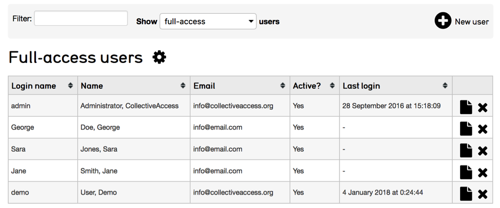
*Fig 4.10: List of Full-access Users in Manage > Access Control*

**Creating User Logins**
You can specify settings for the new user via a form. Enter basic info about the user (name, email, password, etc.) and choose the “user class” from the drop-down list below “User name.” The different user classes are: full-access (a login valid for both the cataloguing interface and the public web site), public-access (which enables login on the Pawtucket-based front-end website only), or “deleted,” which is set for former users who may no longer log in.

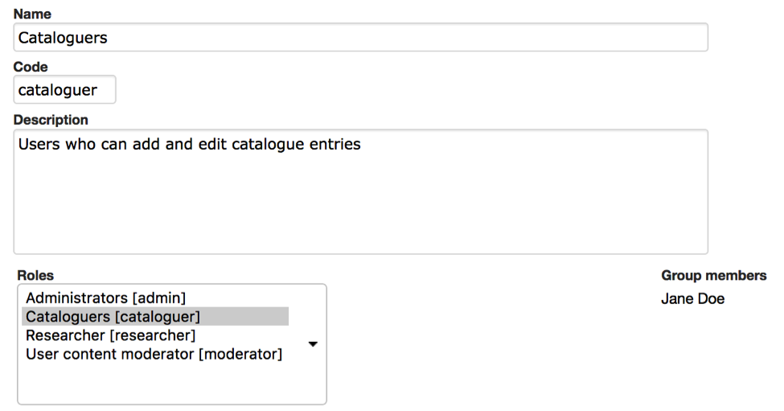
*Fig 4.11: User Login Form*


Be sure to check the “account is activated?” checkbox. You may temporarily disable a login by unchecking this box at any time.

The “Roles” and “Groups” select boxes list available roles and groups for the user. Each login should have one or more role assignments, such as “cataloguer” or “researcher.” The privileges these roles confer are defined in the Roles configuration available to administrators at *Manage > Access Control > Roles*. 

Groups allow you to confer predefined combinations of roles to users, as well as bundle users together for the purpose of sharing forms, sets, and displays. A login does not necessarily have to be associated with a group, but if you wish to convey a predefined bundle of roles or share information within a specific project team, for example, you will want to define that group, add roles and populate it with users. System-wide groups may be managed by administrators at *Manage > Access Control > Groups*. Groups created by users for their own project may be managed at *Manage > My Project Teams*. User-created groups may not confer roles; their members retain only privileges given to them by administrators.
User Groups
To create user groups appearing on the “User Logins” page, navigate to “User Groups” using the left-hand side navigation. A screen will be displayed with existing user groups, which may be edited. To create new groups, use the “New group” button.

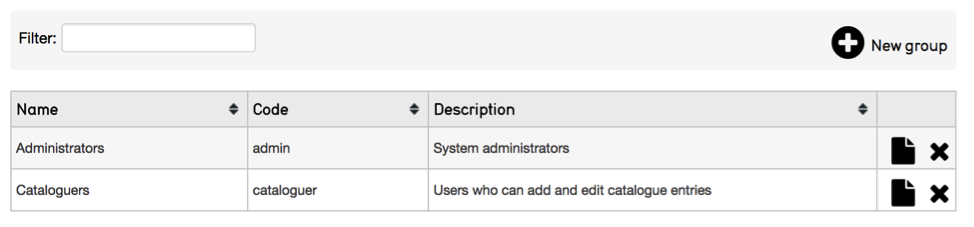
*Fig 4.12: User groups list*

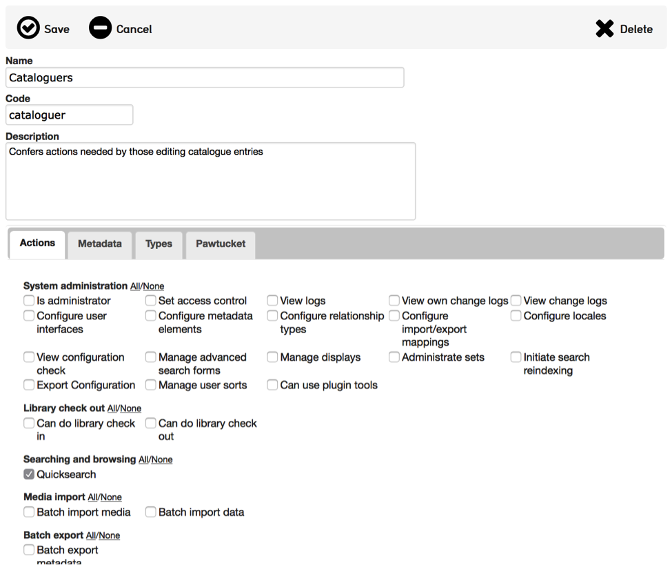
*Fig 4.13: User group form*

Once groups are defined, you may begin to add users. The group can then be used to provide members access to sets, forms and displays.

**Access Roles**
Just as with User Groups, the Access Roles you assign to users must be defined in a separate screen. Click on “Access Roles” in the left-side navigation and a screen will display for roles management.

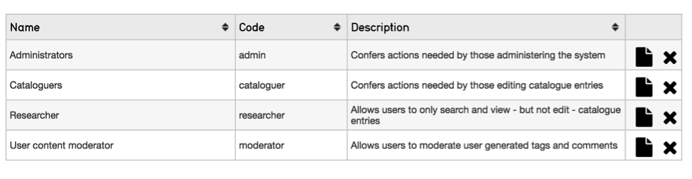
*Fig 4.14: List of Access Roles*

**Defining Access Roles**
To view the permissions set for a given role, click the edit icon. There are four components to roles: Actions, Metadata, Types and Pawtucket. These are represented in four tabs on the Access Roles screen. 

**Actions:**  Define various types of system privileges, such as whether or not a user has permission to manage displays. 

**Metadata:** Defines whether a user has “no access”, “read-only access” or “read/edit access” on a per-field basis. This is useful if there is a particularly sensitive field that you want a cataloguer or researcher to be able to see but not change. 

**Types:** Defines whether a user has “no access”, “read-only access” or “read/edit access” on a record type basis.  

**Pawtucket:** Defines the level of record access users logged into the front-end site, Pawtucket, are able to see. 

Access Roles can prevent certain users from deleting records, changing preferences or using certain plug-ins. You may define as many Access Roles as you wish and your users can be assigned as many roles as are appropriate. 

If you’re unsure of the purpose of any field as you are creating your access roles, you can hover your mouse over it to get a definition. This holds true for actions throughout the system.


*Fig 4.15: Roles Form: Actions Tab*


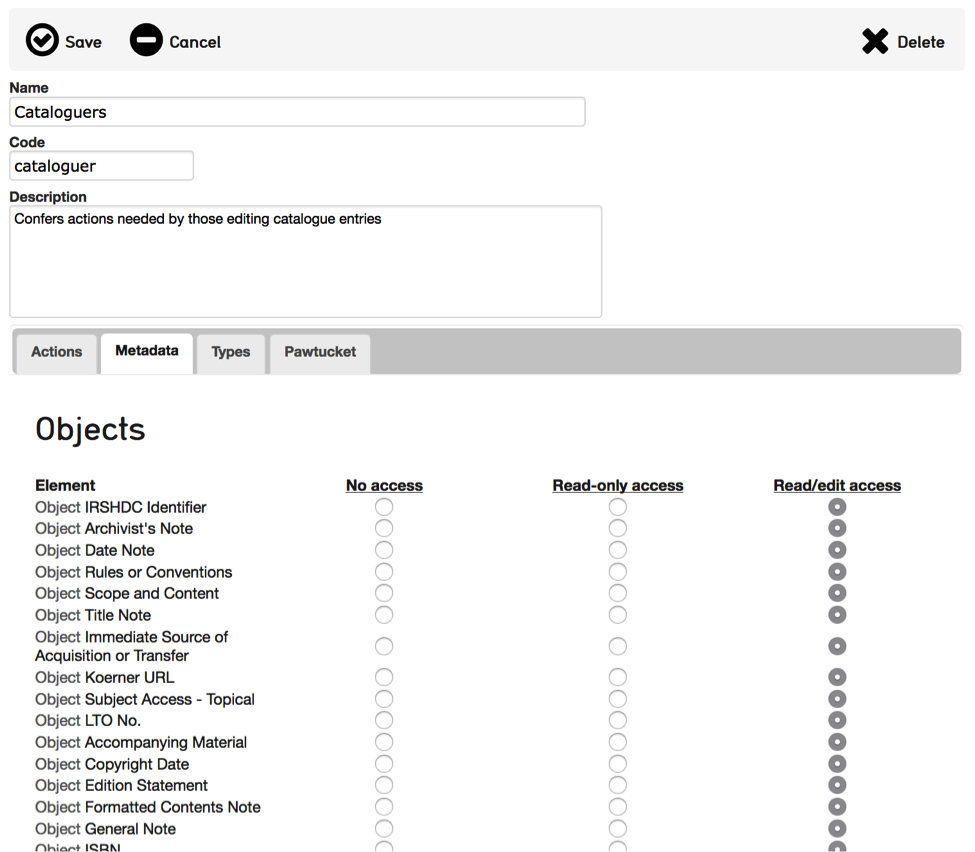
*Fig 4.16: Access Roles Form: Metadata Tab*

	
Pawtucket
---------

The Pawtucket section provides options for maintaining blog-like website page content for your front-end Pawtucket installation. Site Pages and Global Values are only available in Providence if your Pawtucket front-end website is designed to utilize them.

**Site Pages**
Site Pages allows users to create and edit static pages for their front-end Pawtucket website. This feature is useful for site contextual pages containing text that changes periodically, such as About the Project and Contact pages.

At *Manage > Pawtucket > Site Pages*, users will find a list of existing site pages as well as an option to create new pages from available templates. Page content can be edited by clicking the page icon.

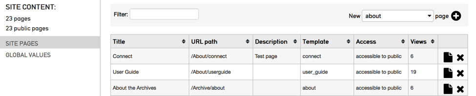
*Fig 4.17: List of site pages*

When editing site pages, there is a combination of template specific and standard fields to enter content in. Fields starting with “Page metadata” are standard for all pages and allow you to assign content in the pages’ HTML meta tags. Additionally, the “Page metadata: URL path” is the url path to access the HTML page in your front-end Pawtucket installation. For this reason the URL path must be unique. Enter template specific content in the “Page Content” bundle and upload images in the “Page Media” bundle. Site pages must have their Access set to “Accessible to public” to be visible.

**Global Values**
Global values are editable text values that may be displayed in any view template in your Pawtucket theme. They are especially useful for managing semi-static text embedded in a web site, such as upcoming holiday hours or planned maintenance. You may edit global values by using the forms at *Manage > Pawtucket > Global Values*.


Logs 
----
					
Logs are a series of reports to monitor system activity including cataloging changes, login activity, search and download. The following logs are available:

- **My Change Log** – Provides a summary of the current users cataloging activity. The list can be filtered by search term and limited by change type, record type and date.

- **Global Change Log** – Provides a system wide summary of cataloging activity. Similar to My Change Log, the Global Change Log can be filtered by search term and limited by change type, record type and date.

- **Events Log** – Provides a system wide summary of events, such as successful and failed login attempts. The list can be filtered by search terms and limited by date.

- **Search Log** – Provides a system wide summary of executed searches, including searches executed through the front-end Pawtucket website. The log provides the date/time, searched upon table, search term, number of hits, user (when available), IP address of user, source and execution time. The list can be filtered by search terms and limited by date.

- **Download Log** – Provides a system wide summary of downloads, including downloads executed through the front-end Pawtucket website. The log provides date/time, record type, record title, user (when available), user class (when available), IP address of user and source (Pawtucket or Providence). The list can be filtered by search terms and limited by date.

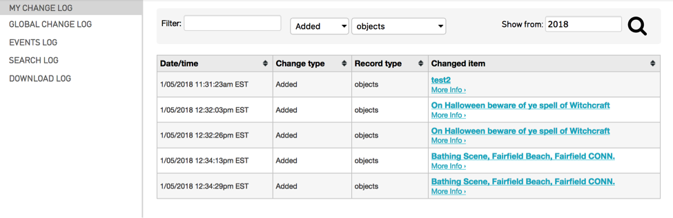
*Fig 4.18 Example My Change Log list*
		

Administration
--------------

The Administration menu, typically used only by system administrators, takes you “under the hood” of CollectiveAccess. This is where User Interfaces, Metadata Elements, and Relationship types are managed. It’s also where some system maintenance is performed. 
