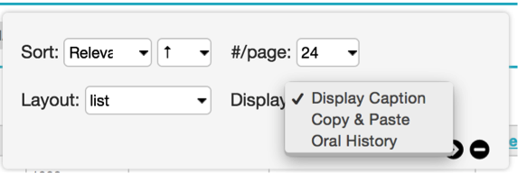
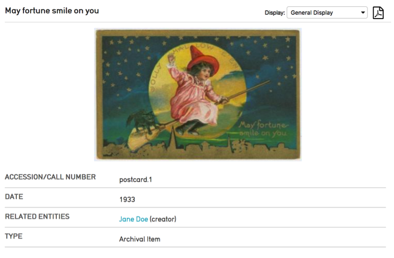
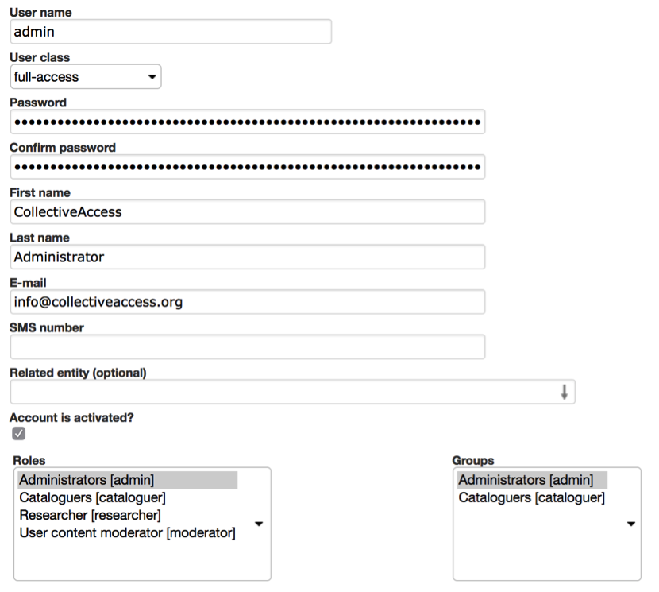

Manage and Site Administration
==============================

.. contents::
   :local:
   
The Manage menu in the Global Navigation contains many user tools as well as functions restricted to site administrators.

*Fig 4.1: Manage menu*

Preferences
-----------		

Users can set optional preferences by navigating to *Manage > My Preferences*. The settings here are specific to the user and will not affect others users in the system. The default preferences will be sufficient for most users and customizing them is not a requirement. However, users may find a few of the options to be helpful.

**General**
Users can select their preferred language, CollectiveAccess theme, whether to Show current location as 'breadcrumb' trail, retain previous search terms and results when performing a search or browse, and can set whether search terms remain editable in the QuickSearch bar or if they are auto-cleared.

**Editing/Batch Editing/Quick Add**
Users can select which User Interface to use for editing, batch editing and quick add forms for specific record types.

**Media**
Users can establish a filenaming policy for media downloaded from CollectiveAccess. This can be set to download with the original filename (as first uploaded) or to rename each downloaded file to the object identifier and a few other choices.

Users may also select which PDF viewer to employ when viewing PDF documents.

**Units of measurements**
Users can choose how measurements are displayed: as entered, or in metric or imperial units or fractions.

Display currency can also be set. By default, currencies are displayed in USD.

**Duplication**
Users who use the record Duplication tool will likely want to set these preferences. These settings control precisely what is duplicated when the feature is employed. For each table, you may select the metadata on a per-field basis, relationships on a per-table basis, and whether or not media representations are duplicated along with the data.

**QuickSearch**
Here users may select which tables appear in QuickSearch results.

**User Profile**
Users may enter contact information into their profile here.

					
Watched Items
-------------

View and delete items from your watched items list. Items are added to the watched items list by clicking on the eye icon   in the item’s Inspector window. Reached through Manage > My Watched Items.

					
Tools
----- 

System specific, custom plugins are accessed here.

Project Teams
-------------
				
Access to Sets, Displays and Advanced Search forms can be shared by groups of individual user accounts called Project Teams. Teams allow you to create project-specific restricted access groups to collaborate with using workflow tools such as Sets, searches and Displays.
					

Displays
--------
					
CollectiveAccess allows fine control over information displayed in search results and in the summary page of records. Any metadata element from the user interface can be added to a Display form. These can be used to view search results, generate PDF reports, or export data to Microsoft Word, Excel, CSV, or other formats. 				

**Using Displays**					
Displays are used in search results and on summary screens of item records.
					
**For Searches:**

*Fig 4.2: Choosing a display for use with search results in the Display Options panel*

To change the display in search results, click on “display options” and select the display you would like to use from the drop down menu, and click “save.”					
For Summaries:

*Fig 4.3: Choosing a display for use with the summary screen*

To select a display to use on a record’s summary screen, use the drop-down box in the top right hand side of page. After selecting, the page will update automatically.
					
**Adding a New Display**				
New displays can be created by selecting Manage > My displays from the Global Navigation and clicking the “New display” button.

*Fig 4.4: Creating a new display*
				
**Display name:** Assign a name to the display.
					
**Display Code:** Assign a unique identifier for the display. This identifier should be only letters, numbers and underscores.
					
**Is System Display?** If set to yes, the display will be available to all users system-wide. If set to no, the display will only be accessible to you, the display’s creator, unless you assign User Access individually or Group Access, for project teams.
			
**Display List:** The display list screen is divided into two columns. The left hand side has a list of all the fields available to the User Interface. The right hand column is where you place the contents of the display itself. To do so, click and drag all of the fields you would like to use from the left-hand to the right-hand side. You can customize the display of each field by clicking on the “info” button and changing the values in the displayed settings panel. 

*Fig 4.5: Customizing display fields*

			
Sets
----

Sets are simply ordered groups of records. They are useful for a wide variety of workflow, management, front-end presentation and sharing tasks. The three most common uses for sets are:

1.	To apply edits to groups of records. Do so by creating a Set and opening it in the Batch Editor. 
2.	To define groups of records for display on a Pawtucket-based front-end website, either on the front page or in a gallery or online exhibition. Pawtucket-based front-end websites can be configured to use specific sets in certain contexts. 
3.	To manage workflow. Practical tasks, such as generating curatorial checklists, grouping together records that require further attention or generating “shopping carts” of objects for reporting can be accomplished by creating sets.
				
A new set can be created by selecting *Manage > My sets*, and then selecting the type of set to create, either a public presentation (for display on a public web site) or a user set (for use in reporting or workflow tasks), and the type of records the set will contain—objects, entities, etc.
				
Assign a Title and Code to the Set, then apply User and Group Access if necessary.

**Items**			
After you have entered basic information about your set and saved, you can click on the Items screen to begin adding records to your set.
					
Items can be found by typing criteria into the search bar, similar to the Basic Search. You will be prompted with relevant matches. Clicking on a match will automatically add it to the set. Once added, items can be dragged and dropped to reorder as desired. Clicking on the white page icon or thumbnail will take you to the set item editor, which allows you to add captions and descriptions to set items. This information is specific to the item in the context of the set, not the record itself.  Set items can be exported in various formats by using the “Export as” option at the top of the Set Items bundle.  
					
Once a set is created, its contents can be quickly displayed on the corresponding Find page using Search By Set. As mentioned earlier, Sets can also be created and added to via Set Tools in the search results screen.

Search Tools
------------
					
**Search Forms**
Just Like Displays, Advanced Search forms can be created and configured by the user. This can be used to create custom searches that cover only the fields you specify. To create a new search form, navigate to Manage > My Search Tools > Search, and then click on the “New Form” button. You can create forms for any primary table.

.. figure:: ../_static/images/4_6.png
   :name: Creating a new advanced search form
   :target: ../_static/images/4_6.png
   :alt: Creating a new advanced search form 
*Fig 4.6: Creating a new advanced search form*

As with Displays, assign a name and code to your search form, and select whether it is a System form. If set to yes, the form will be available to all users system-wide. If set to no, the form will only be accessible to you, the form’s creator, unless you assign User Access individually or Group Access, for project teams. Fields are added and edited in the same manner as displays, above. 
					
Once the desired fields have been added, save the form. To test the search form, navigate to the appropriate find page and select the form from the drop-down, then enter search criteria and click on the “search” button. 

**Saved Searches**
Searches for any record can be saved by clicking the “Save Search” link in Basic Search forms or using the “Save search as” form within Advanced Search forms. You can view, delete and execute your saved searches in Manage > My Search Tools > Saved Searches.

User Generated Content
----------------------

User generated content is tags and comments submitted through the CollectiveAccess front-end component, Pawtucket. These public contributions are reviewed and moderated by navigating to Manage > User Generated Content.

**Comments**
Comments are accessed through the Moderate and Search tabs. If your system is configured to require moderation of user generated content before it is published to your Pawtucket-based front-end website, comments requiring moderation will be listed in the Moderate section. The comment, author, date and title of the record commented on are listed for review. Multiple comments can be selected using checkboxes and approved or deleted.

You can find specific comments within the system using the Search section. Similar to the Moderate section, the Search section has checkboxes alongside each entry so multiple comments can be selected for approval or deletion.

.. figure:: ../_static/images/4_7.png
   :name: List of tags requiring moderation
   :target: ../_static/images/4_7.png
   :alt: List of tags requiring moderation 
*Fig 4.7: List of tags requiring moderation*

**Tags**
Tags are accessed through the Moderate and Search tabs. If your system is configured to require moderation of user generated content before it is published to your Pawtucket-based front-end website, tags requiring moderation will be listed in the Moderate section. The tag, author, date and title of the tagged record are listed for review. Multiple tags can be selected using checkboxes and approved or deleted.

You can find specific tags within the system using the Search section. Similar to the Moderate section, the Search section has checkboxes alongside each entry so multiple tags can be selected for approval or deletion.

Lists and Vocabularies
----------------------

Many metadata elements and structural attributes of the data model are populated by Lists. Any drop-down menu or checklist has a corresponding list, and the definitions of record types (for Objects, Entities, etc.) are defined as lists with specific names. For example, the list of Object types in the system is defined in the “Object types” list.

You can manage these lists by navigating to Manage > Lists & Vocabularies. More information on Lists and Vocabularies can be found here:
http://docs.collectiveaccess.org/wiki/Lists_and_Vocabularies			

Exporters
---------

Custom export mappings are supported to export CollectiveAccess data to a variety of XML formats. For most users the Export Tools - documented in chapter 3 section 4 (3.4) - should be sufficient. For more advanced options see:
http://docs.collectiveaccess.org/wiki/Data_Exporter

Access Control
--------------					
To manage workflow and control access to data, all users have individual CollectiveAccess logins. Users with an administrative login may manage user accounts, using the access control tools reached through Manage > Access Control. These tools allow you to create user login accounts and assign specific roles to users, e.g., “cataloguer” or “researcher”. The roles, in turn, determine the scope and level of access a user has to the system. 

**User Logins**
To create a new user login, go to Manage > Access Control > User Logins. 

.. figure:: ../_static/images/4_8.png
   :name: List of Full-access Users
   :target: ../_static/images/4_8.png
   :alt: List of Full-access Users
*Fig 4.8: List of Full-access Users in Manage > Access Control*

**Creating User Logins**
You can specify settings for the new user via a form. Enter basic info about the user (name, email, password, etc.) and choose the “user class” from the drop-down list below “User name.” The different user classes are: full-access (a login valid for both the cataloguing interface and the public web site), public-access (which enables login on the Pawtucket-based front-end website only), or “deleted,” which is set for former users who may no longer log in.

*Fig 4.9: User Login Form*

Be sure to check the “account is activated?” checkbox. You may temporarily disable a login by unchecking this box at any time.

The “Roles” and “Groups” select boxes list available roles and groups for the user. Each login should have one or more role assignments, such as “cataloguer” or “researcher.” The privileges these roles confer are defined in the Roles configuration available to administrators at Manage > Access Control > Roles. 

Groups allow you to confer predefined combinations of roles to users, as well as bundle users together for the purpose of sharing forms, sets, and displays. A login does not necessarily have to be associated with a group, but if you wish to convey a predefined bundle of roles or share information within a specific project team, for example, you will want to define that group, add roles and populate it with users. System-wide groups may be managed by administrators at Manage > Access Control > Groups. Groups created by users for their own project may be managed at Manage > My Project Teams. User-created groups may not confer roles; their members retain only privileges given to them by administrators.
User Groups
To create user groups appearing on the “User Logins” page, navigate to “User Groups” using the left-hand side navigation. A screen will be displayed with existing user groups, which may be edited. To create new groups, use the “New group” button.

.. figure:: ../_static/images/4_10.png
   :name: User groups list
   :target: ../_static/images/4_10.png
   :alt: User groups list  
*Fig 4.10: User groups list*

*Fig 4.11: User group form*

Once groups are defined, you may begin to add users. The group can then be used to provide members access to sets, forms and displays.

**Access Roles**
Just as with User Groups, the Access Roles you assign to users must be defined in a separate screen. Click on “Access Roles” in the left-side navigation and a screen will display for roles management.

.. figure:: ../_static/images/4_12.png
   :name: Access Roles
   :target: ../_static/images/4_12.png
   :alt: Access Roles 
*Fig 4.12: List of Access Roles*

**Defining Access Roles**
To view the permissions set for a given role, click the edit icon. There are four components to roles: Actions, Metadata, Types and Pawtucket. These are represented in four tabs on the Access Roles screen. 

**Actions:**  Define various types of system privileges, such as whether or not a user has permission to manage displays. 

**Metadata:** Defines whether a user has “no access”, “read-only access” or “read/edit access” on a per-field basis. This is useful if there is a particularly sensitive field that you want a cataloguer or researcher to be able to see but not change. 

**Types:** Defines whether a user has “no access”, “read-only access” or “read/edit access” on a record type basis.  

**Pawtucket:** Defines the level of record access users logged into the front-end site, Pawtucket, are able to see. 

Access Roles can prevent certain users from deleting records, changing preferences or using certain plug-ins. You may define as many Access Roles as you wish and your users can be assigned as many roles as are appropriate. 

If you’re unsure of the purpose of any field as you are creating your access roles, you can hover your mouse over it to get a definition. This holds true for actions throughout the system.

.. figure:: ../_static/images/4_13.png
   :name: Roles Form: Actions Tab
   :target: ../_static/images/4_13.png
   :alt: Roles Form: Actions Tab  
*Fig 4.13: Roles Form: Actions Tab*

*Fig 4.14: Access Roles Form: Metadata Tab*

	
Pawtucket
---------

The Pawtucket section provides options for maintaining blog-like website page content for your front-end Pawtucket installation. Site Pages and Global Values are only available in Providence if your Pawtucket front-end website is designed to utilize them.

**Site Pages**
Site Pages allows users to create and edit static pages for their front-end Pawtucket website. This feature is useful for site contextual pages containing text that changes periodically, such as About the Project and Contact pages.

At *Manage > Pawtucket > Site Pages*, users will find a list of existing site pages as well as an option to create new pages from available templates. Page content can be edited by clicking the page icon.

*Fig 4.15: List of site pages*

When editing site pages, there is a combination of template specific and standard fields to enter content in. Fields starting with “Page metadata” are standard for all pages and allow you to assign content in the pages’ HTML meta tags. Additionally, the “Page metadata: URL path” is the url path to access the HTML page in your front-end Pawtucket installation. For this reason the URL path must be unique. Enter template specific content in the “Page Content” bundle and upload images in the “Page Media” bundle. Site pages must have their Access set to “Accessible to public” to be visible.

**Global Values**
Global values are editable text values that may be displayed in any view template in your Pawtucket theme. They are especially useful for managing semi-static text embedded in a web site, such as upcoming holiday hours or planned maintenance. You may edit global values by using the forms at Manage > Pawtucket > Global Values.

Logs 
----
					
Logs are a series of reports to monitor system activity including cataloging changes, login activity, search and download. The following logs are available:

- **My Change Log** – Provides a summary of the current users cataloging activity. The list can be filtered by search term and limited by change type, record type and date.

- **Global Change Log** – Provides a system wide summary of cataloging activity. Similar to My Change Log, the Global Change Log can be filtered by search term and limited by change type, record type and date.

- **Events Log** – Provides a system wide summary of events, such as successful and failed login attempts. The list can be filtered by search terms and limited by date.

- **Search Log** – Provides a system wide summary of executed searches, including searches executed through the front-end Pawtucket website. The log provides the date/time, searched upon table, search term, number of hits, user (when available), IP address of user, source and execution time. The list can be filtered by search terms and limited by date.

- **Download Log** – Provides a system wide summary of downloads, including downloads executed through the front-end Pawtucket website. The log provides date/time, record type, record title, user (when available), user class (when available), IP address of user and source (Pawtucket or Providence). The list can be filtered by search terms and limited by date.

*Fig 4.16 Example My Change Log list*
		

Administration
--------------

The Administration menu, typically used only by system administrators, takes you “underneath the hood” of CollectiveAccess. This is where User Interfaces, Metadata Elements, and Relationship types are managed. It’s also where some system maintenance is performed. 
