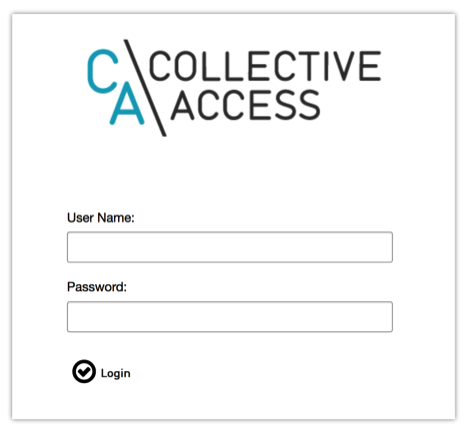
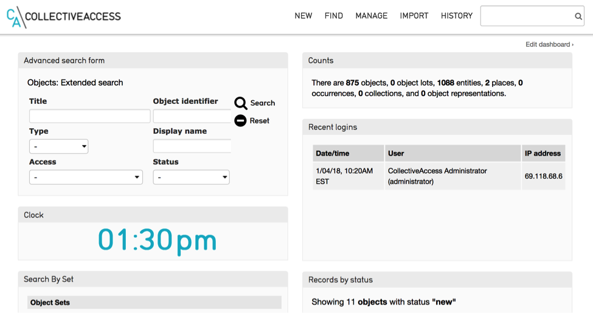
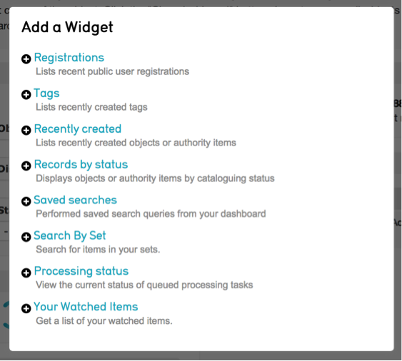

Accessing and Navigating the Database
=====================================

.. contents::
   :local:   
		
CollectiveAccess is a web-based platform that may be accessed from any current web browser. (Chrome, Firefox, Safari or Internet Explorer 10 or better). Multiple users can work in the database simultaneously without worrying about overwriting each other’s work or creating incompatible versions of collections data.

Logging In
----------

Logging in to CollectiveAccess requires a username and a password supplied by the system administrator. To log into the system, launch your web browser and go to your system’s URL (also provided by the system administrator). Enter your username and password into the login form (Fig 1.1)

*Fig 1.1: Logging into the Database*

Access to various functions can be controlled per login. After logging in you will only see the functions for which you have access. If you cannot find or perform a specific action check with the system administrator to verify the privileges for your login have been set correctly.

The Dashboard
-------------

The customizable dashboard (Fig. 1.2) is the first thing you see after logging into the system. This is your home page in CollectiveAccess, and the changes you make to it are visible only to you. You can return to the dashboard at any time by clicking the CollectiveAccess logo in the upper left-hand corner of your screen.

The main function of the Dashboard is to display the widgets for your system. Widgets provide specialized functions and serve as mini-applications within Providence. You can include as many or as few of them as you wish and arrange them at will on the dashboard.

Consult the “Available Widgets” section below for a list of dashboard widgets.

*Fig 1.2: The Dashboard*

**Top Logo**					
Clicking the logo in the upper left-hand corner of the browser window will always return you to the dashboard. It is available at all times, in all areas of the system. Other persistent tools are arrayed along the top of the browser window to the right of the logo, including system menus used to navigate within CollectiveAccess and the QuickSearch tool. These are described in detail in section 1.3.

**Edit Dashboard Button**		
The “Edit Dashboard” button allows you to add, move or delete widgets. Widgets are mini-applications that provide useful (and occasionally humorous) information or functionality. Example CollectiveAccess widgets include Recent Changes (displays recent changes to specific types of records), Counts (displays the number of records by type), Recent Logins (lists who has logged in recently) and LolKatz (displays an ever changing gallery of funny cat photos grabbed from the internet!). See Available Widgets below for a complete list.
				
**Clear Dashboard**					
Clicking this button will remove all widgets from your dashboard.
					
**Add Widget**					
Clicking the “Add widget” button will list all available widgets for inclusion on your dashboard. Once a widget has been added you may drag and drop it into place anywhere you like. Clicking “Done” will save your dashboard changes. Widgets may only be added/removed or moved around the dashboard while in editing view.  Widget settings are accessed by clicking the settings information icon   at the top of each widget while in editing view.

*Fig 1.3: Widget menu*

**Available Widgets**
- **Advanced Search Form – Displays one of the Advanced Search forms you have configured for your system. Click the settings information icon to choose the form you wish to display.

- **Clock** – Displays the current time.

- **Counts** – Shows the current count for each type of record in your system. Settings allow you to choose which record types to display.

- **Recent Logins** – Shows the login activity of your users. Edit the settings to change the time frame for which you would like to see login activity.

- **Links** – Displays shortcuts to external project and reference websites.

- **lol Katz** – Displays a random lolcat image.

- **Message of the Day** – Displays your desired text.

- **Notifications** – Displays notifications.

- **Random Object** – Displays a random object from your system.

- **Recent Changes** – Acts like a mini-log, displaying recent changes to your system including the name of the user, the date and time of the change, what record was affected and how. Use the settings information icon to select which table to display (Objects, Entities, etc.), as well as the desired time frame (past 24 hours, 48 hours and so on.)

- **Comments** – Displays recent comments posted to your Pawtucket-based front-end website, if you have User Functions installed. Change the settings to view only moderated comments, unmoderated comments or both.

- **Registrations** – Displays recent public user registrations if you have a Pawtucket based front-end website that permits users to register. 

- **Tags** – Lists recently created Tags

- **Recently Created** – Lists recently created records in your system. Settings allow you to choose what type of recently created record to display and how many.

- **Records by Status** – Lists records that have been assigned a chosen status. Change the settings to choose which status to display, the type of record and how many you wish to see.

- **Saved Searches** – Displays shortcut links that allow you to quickly run saved searches. See manual entry for `Set Tools <https://manual.collectiveaccess.org/usermanual/manage.html#search-tools>`_.

- **Search by Set** – Displays the objects in a chosen Set. See manual entry for `My Sets <https://manual.collectiveaccess.org/usermanual/manage.html#my-sets>`_.

- **Processing Status** – Displays the status of any media processing.

- **Your Watched Items** – Lists the items currently being watched and the recent changes made to each record. See manual entry for `Watched Items <https://manual.collectiveaccess.org/usermanual/manage.html#watched-items>`_.

**Settings Information Icon**				
While in edit mode any widget on your dashboard may be customized by clicking on the settings information icon (in the upper right corner of each Widget). For instance, in the Recent Changes widget, you can control how far back in time the change list goes as well as the type of records for which changes will be tracked.
					
**Delete Button**
Removes the widget from the dashboard. Widgets can always be re-added with the “Add Widget” button.

Navigation
----------

Bracketing the CollectiveAccess browser window are two navigation bars. The Global Navigation bar is an area at the top of the browser window reserved for application menus, a “home” button” (the application logo) that returns you to your dashboard and the QuickSearch tool. The Status bar is a narrow area at the bottom of the browser window that includes the current account name, access to your preferences and a logout button, as well as some diagnostic information.
		
The Global Navigation bar is the primary access point to CollectiveAccess functions. In addition to the “home” button there are five standard menus – New, Find, Manage, Import and History – and the QuickSearch tool. Each of the menus expands when the mouse cursor is held over them, revealing all of the functions to which your login has access.

**New**				
The “New” menu contains options for creating new records. Use this menu to create new records for any of the primary record types.		
			
**Find**
The “Find” menu provides discovery tools specific to each record type (unlike the QuickSearch, described below, which targets all types of records). Three kinds of discovery tools are available:

- **Basic Search** – a simple text search box that, by default, searches all fields in a single record type.

- **Advanced Search** – a search on specific fields using purpose built search forms.

- **Browse** – allows you to browse records using lists of existing values in specific fields.

See the manual page `Searching and Browsing <https://manual.collectiveaccess.org/usermanual/find.html>`_. 

**Manage**
The “Manage” menu includes a variety of options to manage your CollectiveAccess preferences and tools. Options to manage personal search forms, reports and sets of records are available in this menu. System administrators will find tools for managing user logins and system setup in this menu. User generated content submitted through Pawtucket-based front-end commenting and tagging tools and content managed front-end pages are also managed here. See the manual page `Manage and Site Administration <https://manual.collectiveaccess.org/usermanual/manage.html#>`_

**Import**
The “Import” menu contains options for importing media and metadata from external sources. Additionally, a media import tool is available for the batch ingest of images and time-based material.

**History**			
The “History” menu provides a list of recently viewed and edited records. It will only appear in the Global Navigation bar after you have searched for and viewed records in the system.
					
**QuickSearch**					
Always available in the upper right-hand corner of the browser window, the QuickSearch is the simplest and most convenient search tool in CollectiveAccess. It will cast a wide net for terms entered into it, searching across all fields in all tables of records.
