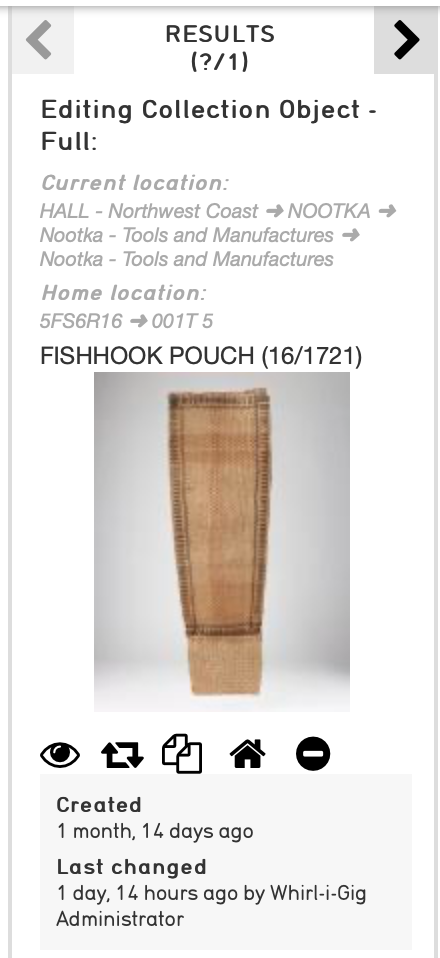
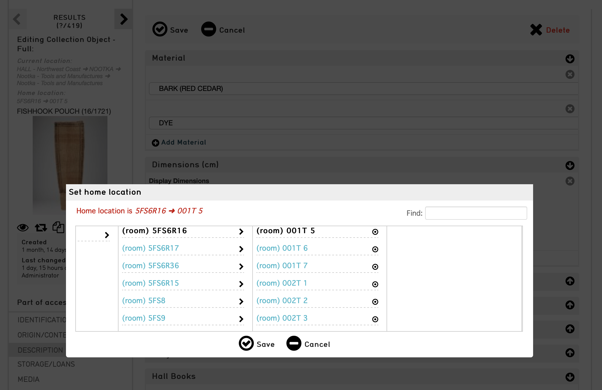

Tracking current object location
================================

.. contents::
   :local:   
   
   
.. note:: The system for location tracking was completely rebuilt for version 1.7.9 with a new, more general, configuration format and additional features. Older configurations should work as before, but the configuration options described below should be used for new setups. To maintain compatibility with future releases consider updating your existing configuration to use the current options.


Overview
--------
CollectiveAccess provides a storage location hierarchy to describe the physical locations where collection objects may be located, displayed or stored. Storage locations are records like any other and may be associated with objects using relationships. One can record the current location of an object by simply creating a relationship between object and location. 

This arrangement has the advantage of simplicity but comes with serious drawbacks:

* If your objects move often you'll soon have a long list of previous locations, which can make it difficult to figure out what the *current* location is.
* While the current location can be distinguished using a specific relationship type (Eg. "past location" for previous locations and "current location" for the latest location), you must manage setting of these types yourself, which is labor intensive and prone to error.
* Removing previous locations and only recording only a single, current location will make for a simpler and easier to manage display, but means no location history is maintained. For most users, losing location history data is unacceptable.
* Only storage location records may be used to record location. If an object is on loan or exhibition workarounds must be employed, such as dummy "On loan" and "On exhibition" storage locations records.

The history value tracking system (available as of CollectiveAccess version 1.7.9) provides a flexible way to track object locations over time. It can also be used to track other time-varying information such as provenance and current collection. The system employs tracking *policies* to maintain chronologies based upon one or more data elements, and can return full histories as well as current values for any type of record. Tracking of location is the focus in this discussion, but the approaches described here may be applied to other types of time-varying information.

Tracking approaches
-------------------
To handle the range of tracking methodologies required by different types of museum and archival collections CollectiveAccess offers two approaches to location tracking:

    - **Workflow-based location tracking.** Current location is recorded for an object across a range of record types representing various related activities, including loans, movements, occurrences (typically representing exhibitions), collections, deaccession and storage location/inventory. The types of records considered part of the tracking workflow, how their dates are established for assembly into a chronology, and how they are displayed within the chronology are specified in a tracking *policy*. Policies are configured in the :ref:`app.conf <app_conf>` configuration file using the *history_tracking_policies* described below.
    - **Movement-based location tracking.** Location is recorded for objects in related movement records. Each movement record captures details about a specific change in location for one or more objects. The current location for an object is considered to be the location referred to by the most recent movement by date. Movement of entire storage locations within the location hierarchy can be configured to generate a movement record, allowing current location tracking to be based upon both individual object moves and movements of containers and other storage units. Movement-based tracking is more complicated to configure and use, and is only called for when capture of complex metadata (packing, transport, insurance, etc.) about chain of custody and methods used to transition groups of objects between locations is required. This additional documentation comes at the expense of added complexity and data entry, as every movement of an object or group of objects to a new location requires completion of a full movement record. 
    
.. note:: Movement-based tracking is only used when for object location tracking. If tracking non-location values such as provenance, use workflow-based tracking.


Configuration
-------------

Configuration for workflow and movement-based tracking use the configuration format, with minor differences. Most configuration occurs within the top-level ``history_tracking_policies`` entry in :ref:`app.conf <app_conf>`. Under this entry are two keys, both mandatory:

	- **policies** defines all available tracking policies. Most operational configuration resides under this key.

	- **defaults** specifies which policy should be used by default for a given :ref:`table <primary_tables>`. You may define multiple policies per table and declare specific policies be used in various contexts such as user interface bundles. Default policies are a convenience that reduce configuration complexity by setting a standard policy to be overridden as needed.

An example ``history_tracking_policies`` configuration for workflow-based location tracking is shown below:
::

	history_tracking_policies = {
		defaults = { 
			ca_objects = current_location
		},
		policies = {
			current_location = {
				name = _(Current location),
				table = ca_objects,
				mode = workflow, # movements or workflow
				elements = {
					ca_storage_locations = {
						__default__ = {
							date = ca_objects_x_storage_locations.effective_date,
							setInterstitialElementsOnAdd = [effective_date],
							useDatePicker = 0,
							template =
							<l>^ca_storage_locations.hierarchy.preferred_labels.name%delimiter=_➜_</l>  <ifdef code='ca_objects_x_storage_locations.movement_by'> <br>MOVED BY: ^ca_objects_x_storage_locations.movement_by</ifdef>  <ifdef code='ca_objects_x_storage_locations.movement_comments'> <br>COMMENTS: ^ca_objects_x_storage_locations.movement_comments</ifdef>,
							trackingRelationshipType = related,
							restrictToRelationshipTypes = [related]
						}
					},
					ca_occurrences = {
						exhibition = {
							date = ca_occurrences.exhibition_date,
							setInterstitialElementsOnAdd = [effective_date],
							template =
							 <l>^ca_occurrences.preferred_labels.name</l>,
						},
						__default__ = {
							date = ca_objects_x_occurrences.effective_date,
							setInterstitialElementsOnAdd = [effective_date],
							template =
							 <l>^ca_occurrences.idno</l> ^ca_occurrences.preferred_labels.name,
						}
					 },
					 ca_loans = {
						__default__  = { 
							date = ca_loans_x_objects.effective_date,
							setInterstitialElementsOnAdd = [effective_date],
							color = F78B8B,
							template = <l>^ca_loans.idno</l> ^ca_loans.preferred_labels (^ca_loans.institution ^ca_loans.date) <ifdef code='ca_loans_x_objects.movement_comments'> <br>COMMENTS: ^ca_loans_x_objects.movement_comments</ifdef>,
							restrictToRelationshipTypes = [loan]
						  }   
						}
					}
				}
			}  
	 }
	 
Within the ``policies`` section are keys for each configured policy. In the example, a single policy with the code ``current_location`` is defined. Within each policy are entries for ``name`` (the display name of the policy), ``table`` (the tables to which this policy applies), ``mode`` (workflow or movement-based tracking) and ``elements``. 

``Elements`` defines the various types of data tracked by the policy. Each key is a :ref:`table <primary_tables>` name. Within each table block are entries for types. The special ``__default__`` type is used to match any type not explicitly listed for the table. In the example the configuration for storage locations (ca_storage_locations) applies to all types of locations. The ca_occurrences entry includes a configuration specifically for occurrences of type "exhibition", and a default configuration for all other types.

Each per-type configuration must include entries for ``date`` and ``template``. ``date`` is a bundle specifier for a date field in either the related table or the relationship to that table. The value in the specified field will be used to determine where in the chronology of tracked values each related record is placed. In the example, the object-location relationship ``effective_date`` intrinsic field is used to track locations, which the occurrence ``exhibition_date`` metadata element is used to place exhibitions in time. ``template`` is a :ref:`display template <display_templates>` employed to format data for the related record in the chronology. The template will be evaluated relative to the relationship between the object and related record, allowing inclusion of both interstitial (relationship-based) and related-record metadata. In the example the template for loans includes data from both the related loan record as well as the object-loan relationship.

Other, optional keys in per-type configuration configuration include ``color`` (chronology color-coding), ``restrictToRelationshipTypes`` (a list of relationship types to limit chronology display to), ``setInterstitialElementsOnAdd`` (a list of interstitial fields to allow the user to set when creating a relationship from within the chronology). The full list of possible entries is:

.. csv-table::
   :widths: 20, 60, 20
   :header-rows: 1
   :file: tracking_workflow_config.csv

The chronology bundle
---------------------  

You can display a chronology of values for a policy in the editing user interface using the ``history_tracking_chronology`` bundle.

.. image:: images/chronology.png
    :width: 600px

The bundle is designed to provide a centralized control panel for managing current location, and includes tools to update location with new loans, movements, occurrences, storage locations, collections and entities. It also offers tools to remove existing relationships and edit interstitial (relationship-specific) data. These tools may be disabled if required. 

It displays related locations, occurrences, loans, movements, etc. in chronological order, with the most recent first (although this can be changed). Information from each related record can be formatted using display templates. By default all settings are taken from the policy configuration, but can be overriden by values specific to placements of the bundle in the user interface.

At a minimum when adding a chronology bundle to the editing user interface you must specify a policy. There are many other options which can be set in the an :ref:`installation profile <installation_profiles>` if desired. Available options include:

.. csv-table::
   :widths: 20, 60, 10, 10
   :header-rows: 1
   :file: chronology_bundle_options.csv


The current contents bundle
---------------------------

The current contents bundle (``history_tracking_current_contents``) enables display of all items that currently have a given record as their current value. It is typically used on storage location records to display a list of objects currently resident in that location. 

The following options are available to set in an :ref:`installation profile <installation_profiles>`:

.. csv-table::
   :widths: 20, 60, 10, 10
   :header-rows: 1
   :file: current_contents_bundle_options.csv
   
Inspector display
-----------------


    
You can display the current value of a history tracking policy in the editor "inspector" (the information panel on the upper left-hand corner of the editor interface). You can set the policy to use on a per-table and/or per-type basis using the ``inspector_tracking_displays`` entry in app.conf. 

::

	inspector_tracking_displays = {
		ca_objects = {
			__default__ = {
				policy = current_location,
				label = _(Current location)
			}
		}
	}

    
Each entry within ``inspector_tracking_displays`` is a table name. Each table in turn has a list of types (and/or the catch-all ``__default__`` type that matches type not explicitly configured). Each type has two entries: ``policy`` (the policy to use) and ``label`` (A label placed above the current value). In the example above the current value for the "current_location" policy is displayed when editing objects of all types.

A typical inspector with this configuration would appear as show in the screen image on the right.


Display in templates
--------------------

Current value information may be included in :ref:`display templates <display_templates>` using the following tags:

.. csv-table::
   :widths: 35, 65
   :header-rows: 1
   :file: location_display_tags.csv

Searching on current values
---------------------------

Current values can be indexed for search on a per-table, per-policy basis. Any value in the related table can be indexed, enabling one to search, for example, on the description of current loans only for objects. Typically only basic values such as name and identifier are indexed as current values, allowing for searches on storage location names, loan recipients, etc.

To set up current value indexing you will need to insert new directives into your :ref:`search_indexing.conf <search_indexing_conf>` file. For each related table block to be indexed add a new ``current_values`` entry. Within this entry add entries for each policy. Within the policy entry add field indexing entries in the same format as used for regular indexing.

The example below is a fragment from the ``ca_objects`` indexing configuration. Note the added ``current_values`` blocks. ``current_location`` refers to a policy configured in app.conf.

.. code-block:: none

	# ------------------------------------
	ca_storage_locations = {
		tables = {
			places = [ca_objects_x_storage_locations],
		},
		fields = {
			location_id = { DONT_INCLUDE_IN_SEARCH_FORM },
			idno = { STORE, DONT_TOKENIZE, INDEX_AS_IDNO, BOOST = 100 }
		},
		current_values = {
		    current_location = {
			    idno = { STORE, DONT_TOKENIZE, INDEX_AS_IDNO, BOOST = 100 }
			}
		}
	},
	# ------------------------------------
	ca_storage_location_labels = {
		tables = {
			places = [ca_objects_x_storage_locations, ca_storage_locations]
		},
		fields = {
			location_id = { DONT_INCLUDE_IN_SEARCH_FORM },
			name = { INDEX_ANCESTORS, INDEX_ANCESTORS_START_AT_LEVEL = 0, INDEX_ANCESTORS_MAX_NUMBER_OF_LEVELS = 10, INDEX_ANCESTORS_AS_PATH_WITH_DELIMITER = .}
		},
		current_values = {
		    current_location = {
			    name = { }
			}
		}
	},
	# ------------------------------------


In this example both the "idno" intrinsic field (part of ca_storage_locations) and the "name" intrinsic field in storage location preferred labels (the ca_storage_location_labels table) are indexed for objects as current values. 

To search on current values use the built-in "current_values" access point. Eg. to find all records with current value "Cellar" in any field search on ```current_values:Celler```. To limit the search to a specific policy use the access point "current_values.<policy code>". Eg. ```current_values.current_location:Cellar```. To search on a specific policy and field use "current_values.<policy_code>.<field code>". The field code used must be indexed for the search to return results.

These same access point formats can be used when configuring advanced search forms.


Browsing on current values
--------------------------

To browse on current location add a facet to :ref:`browse.conf <browse_conf>` of type "current_value":

.. code-block:: none

	current_location = {
			type = current_value,
			restrict_to_types = [],
			policy = current_location,
			
			display = {
				ca_storage_locations = {
					__default__ = { template = ^ca_storage_locations.hierarchy.preferred_labels.name%delimiter=_&gt;_ }
				}
			},
			
			include_none_option = No location specified,
			
			label_singular = _("current location"),
			label_plural = _("current locations")
		},

Current value-specific settings include ``policy``, which must be set and ``display``, which customizes display of current values within the browse. If not defined formatting from the policy is used.

The ``collapse`` facet option controls which sorts of current values are collapsed into general headings rather than displayed individually. Keys of the entry are table names and type separated with a slash (“/”). Values are text with which to represent the collapsed group in the browse facet. For example, to collapse all occurrences of type “exhibition” into a single facet value labeled “On loan” use: 

.. code-block:: none

	collapse = {
		ca_occurrences/exhibition = On loan
	} 

Selecting “On loan” would return all objects where the current location is any exhibition. Without the collapse setting, each exhibition would be listed individually.


Home locations
--------------

As of version 1.7.9 it is possible to set a "home" location for an object. The home location is its typical storage location. If set, both the chronology (``history_tracking_chronology``) and contents (``history_tracking_current_contents``) bundles can include options to return objects to their home locations, noting the change in the chronology.

Home location can be set by clicking the small house icon in the object editor inspector panel. A hierarchy browser will appear from which you can select the home location.



To display the home location in the inspector panel set the ``inspector_home_location_display_template`` entry in app.conf to show the desired storage location fields and formatting. The ``home_location_display_template`` entry defines a template for formatting the home location in display templates and in the hierarchy browser.

A reasonable configuration for these entries, displaying the selected home location prefixed by its parent location is:

.. code-block:: none

	inspector_home_location_display_template = "<unit relativeTo='ca_storage_locations.hierarchy' delimiter=' ➜ '>^ca_storage_locations.preferred_labels.name</unit>"
	home_location_display_template = <l><inspector_home_location_display_template></l>

The ``inspector_home_location_display_template`` sets the format in the above example. The ``home_location_display_template`` takes that format and surrounds it with <l> tags to make it a clickable link.

Home locations can be output in display templates for objects using the tag ```^ca_objects.home_location_value```. The value returned by this tag will be formatted according to the template format in the app.conf ``home_location_display_template`` entry.


Updating the cache
------------------

For performance reasons, the current location of the object is cached in the database and used when browsing. Since current location values are calculated based upon the settings in the app.conf change in configuration will likely invalidate the cached data. To regenerate the cache and ensure accurate browse results be sure to run the following caUtils command on the command line:

``caUtils reload-current-values-for-history-tracking-policies``

If your current value browse is returning unexpected results it is recommended to run the command, which may resolve the issue.
